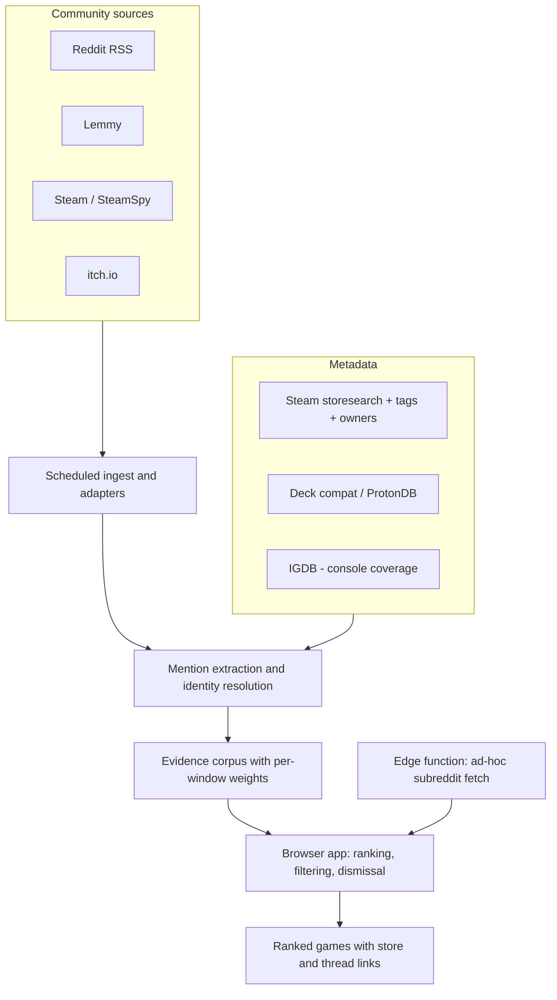
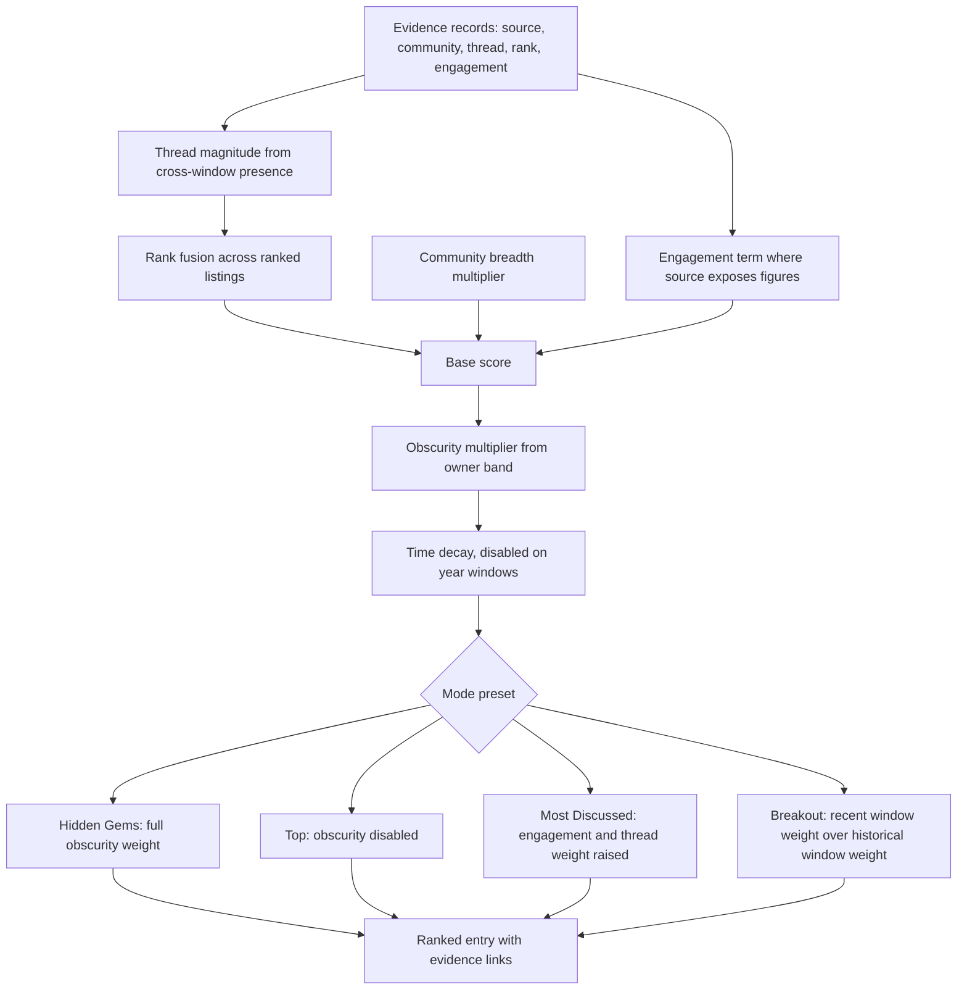

# GameRankScout - Plan

## Goal Capsule

- **Objective:** Ship GameRankScout (GRS), a community-signal game discovery app that ranks games by what people are actually discussing across Reddit, Lemmy, Steam and itch.io, and surfaces the ones the reader is unlikely to have heard of.
- **Product authority:** This plan owns the full v1 product — ingest, ranking, enrichment, filtering, and the installable web app. User accounts and server-side per-user state are explicitly future work and are not active scope.
- **Open blockers:** None. Every data source the product depends on has been verified reachable without credentials or payment. IGDB, which needs free self-service credentials, is confined to console metadata and gates no core capability.
- **Execution profile:** Greenfield. Three layers built in dependency order — ingest, then corpus and ranking, then the app — each independently verifiable before the next depends on it. Adapters and the scoring function are proven against recorded payloads; no test reaches a live source.
- **Stop conditions:** Stop and surface rather than guess if a verified source starts rejecting requests, if mention extraction cannot reach acceptable precision on the sample corpus, or if any requirement would need paid or credentialed access to satisfy.
- **Tail ownership:** This plan ends at a working, installable app running against a real corpus. Deployment target selection and domain setup are the implementer's call within the constraints in the Planning Contract.

---

## Product Contract

### Summary

GRS runs a scheduled ingest across community sources, resolves game mentions to canonical games, and publishes a ranked corpus that the browser filters by platform, genre, timeframe and handheld-suitability. The default ranking demotes games the reader has probably already heard of, and every ranked game links out to its store page and back into the threads that ranked it. It installs as a PWA and costs nothing to run.

### Problem Frame

Finding a game worth playing currently means scrolling a Steam queue tuned to what you already bought, watching genre-specific YouTube channels, and reading whatever subreddit thread happens to surface. The failure is not evaluation — it is coverage. Good games are being discussed enthusiastically in communities the reader does not have time to sweep, and they never reach him.

Manually sweeping those communities is the workaround, and it is expensive enough that it does not happen. The cost is not a bad decision about a game; it is a game never entering consideration at all.

This shapes the product in a specific way: GRS is responsible for *surfacing and compressing*, not for judging. Deciding whether a surfaced game is a good fit stays with the reader, which is why thread links are a first-class output rather than a detail — the community discussion is the evaluation surface, and GRS's job ends by delivering the reader into it.

### Key Decisions

- D1. **Signal-shaped, not Reddit-shaped.** Sources sit behind adapters with a common evidence shape, so any one source closing degrades GRS rather than ending it. (session-settled: user-directed — chosen over a Reddit-only build: the value is community consensus, and Reddit's free surfaces are actively closing.) Governs R4, R5.
- D2. **Scheduled ingest into a static corpus; ranking runs in the browser.** Ingest cost stays constant as readership grows, sources only ever see one crawler, and the app works offline. (session-settled: user-directed — chosen over a self-hostable container and a full backend: free to run, and the ranking function stays portable if a backend is needed later.) Governs R6, R28, R29.
- D3. **Credential-free by default.** Every core capability uses a source verified reachable with no signup. IGDB is the sole exception and is confined to console and cross-platform metadata. Governs R13, R30.
- D4. **Unfamiliar-first is the default ranking, not a mode.** The stated failure is never hearing about the good thing, so a faithful popularity ranking is close to the opposite of the product. (session-settled: user-directed — chosen over straight popularity, breakout-only, and mode-less lenses.) Governs R17.
- D5. **"Already known" is inferred from an objective obscurity proxy, plus explicit dismissal.** Works from first run with no setup and no account, and survives open-sourcing. (session-settled: user-directed — chosen over Steam library import and manual-only marking: import covers PC only and misses console play entirely.) Governs R17, R24.
- D6. **Rank fusion replaces upvote arithmetic.** Reddit RSS exposes no scores, and raw upvotes were never comparable across communities of different sizes, so position in a ranked list is the portable signal. Governs R15.
- D7. **A large thread is allowed to dominate.** Thread count is not damped; magnitude weighting lets a genuinely viral thread outrank steady chatter. Safe because obscurity, not damping, does the mainstream suppression. (session-settled: user-directed — chosen over log-damping thread frequency.) Governs R15, R16.
- D8. **Magnitude is inferred from cross-window presence.** A post appearing in the week, month and year top lists is demonstrably large, and those windows are already fetched. Comment-feed depth saturates near 100 and serves only as a tail tie-breaker. Governs R16.
- D9. **Genre filtering is built on community tags, not formal genres.** Store genres are too coarse for mood-based selection; tags carry the vocabulary readers actually think in. Governs R21.
- D10. **Momentum compares recent against historical activity within a single ingest run.** A game's breakout is its weight in the recent window relative to its weight in the historical window, both fetched together over the same communities. Comparing successive days instead would confuse a game gaining traction with the reader adding a community. Governs R18.
- D11. **Sparse results widen rather than empty.** Stacked filters legitimately match almost nothing; relaxing the timeframe with a visible notice preserves usefulness without silently ignoring a filter. Governs R25.
- D12. **Platform coverage is inclusive rather than minimal.** Xbox joins the named consoles and store links are not restricted to Steam, since excluding a platform costs discovery reach while including one costs a metadata lookup that already runs. Governs R12, R22.
- D13. **Interface quality is a requirement, not a later polish pass.** A discovery tool competes with the reader's existing habit of scrolling a store queue; friction or an unfinished feel returns them to that habit regardless of ranking quality. Governs R31, R32, R33, R34, R35, R36.
- D14. **Full scope is the v1 target.** No single-source or single-timeframe staging. (session-settled: user-directed — chosen over a phased build starting from Reddit alone.)

### Requirements

**Sources and ingest**

- R1. GRS ships with a curated set of gaming communities enabled by default, spanning general discussion, recommendation-seeking, and handheld play, plus at least one community per top-level genre in R21.
- R2. GRS presents a broader recommended list the reader can enable individually, weighted toward genre- and niche-specific communities.
- R3. The reader can add an arbitrary subreddit or community not present in either list.
- R4. Each source is implemented behind an adapter producing a common evidence record, and can be enabled or disabled independently by the reader.
- R5. Sources covered at v1 are Reddit, Lemmy, Steam and itch.io.
- R6. Ingest runs on a schedule and never blocks a reader request.
- R7. Ingest paces its requests to stay within each source's rate limits and backs off on rejection.
- R8. A community added by the reader that the scheduled ingest has not yet covered is fetched through an on-demand path.
- R9. Disabling a source removes its evidence from ranking without requiring a re-ingest.

**Game identification and enrichment**

- R10. GRS extracts candidate game mentions from post titles, post bodies, and comments.
- R11. Extracted mentions resolve to a canonical game identity, so the same game mentioned across communities ranks as one entry.
- R12. Each ranked game carries a link to its primary store page, which may be Steam, another PC storefront, or a console store depending on where the game is sold.
- R13. Each ranked game carries genre tags, platform availability, and a popularity measure.
- R14. Each ranked game links to the specific threads that contributed to its ranking, so the reader can enter the discussion.

**Ranking**

- R15. A game's score combines its position in ranked source listings, the breadth of distinct communities discussing it, and engagement figures where a source exposes them.
- R16. Each contributing thread is weighted by inferred magnitude; a game is not penalised for being discussed in few threads.
- R17. The default ranking demotes games with high mainstream popularity relative to their discussion volume.
- R18. The reader can switch ranking mode; modes at v1 are Hidden Gems, Top, Most Discussed, Breakout, and Rising.
- R19. Ranking modes are presets over one scoring function rather than separate algorithms.
- R20. The reader can rank over past week, past month, past six months, and past year.

**Filtering and reader control**

- R21. The reader can filter by genre or mood. The top-level genre set covers action-adventure, RPG, survival, shooter, simulation, strategy, sports and racing, puzzle, fighting, and horror; finer-grained discovery genres such as roguelike, metroidvania, cozy and souls-like are reachable through the tag vocabulary rather than as top-level entries.
- R22. The reader can filter by platform; the platform set covers a general default plus PC, Nintendo Switch 1 and 2, PlayStation 5, Xbox Series X and S, Android, and iOS.
- R23. Within PC, the reader can restrict results to games suitable for handheld play.
- R24. The reader can dismiss a game, and a dismissed game stays out of subsequent rankings.
- R25. When active filters produce few results, GRS widens the timeframe and states that it did so and why.

**Delivery**

- R26. The app is responsive and usable on a phone.
- R27. The app is installable from the browser as a standalone app.
- R28. The app remains usable against the most recently retrieved corpus without a network connection.
- R29. Ranking is implemented as a pure function over the corpus, executable without a server.
- R30. Running GRS requires no paid API and no credentials for any core capability.

**Experience quality**

- R31. The default view is useful on a cold open with no configuration; reaching a ranking the reader can act on requires no setup step.
- R32. Changing filter, mode, or timeframe re-renders the ranking without an interstitial loading state.
- R33. The interface is operable one-handed on a phone, including filter and mode changes.
- R34. The evidence behind a game's rank — the threads that produced it — is reachable in a single interaction from the ranking.
- R35. Empty, sparse, offline, first-run, and momentum-unavailable states are designed states with their own copy, not incidental fallbacks.
- R36. The interface is visually consistent and finished across every state, with no unstyled or placeholder chrome.

### Key Flows

- F1. Scheduled ingest
  - **Trigger:** The scheduled job fires.
  - **Steps:** Each enabled adapter fetches its communities across the supported time windows with pacing. Mentions are extracted and resolved to canonical games. Metadata is attached, and the resulting corpus is published with each game's per-window weights.
  - **Outcome:** A fresh corpus is available to the app, superseding the previous one.
  - **Covered by:** R4, R5, R6, R7, R10, R11, R13

- F2. Discovery session
  - **Trigger:** The reader opens GRS.
  - **Steps:** The app loads the current corpus, applies the reader's saved platform, genre, timeframe and mode selections, and renders the ranking; the reader opens a game to see its store link and contributing threads, and may dismiss it.
  - **Outcome:** The reader either enters a discussion thread or removes a game from future rankings.
  - **Covered by:** R14, R17, R18, R20, R21, R22, R23, R24, R29

- F3. Adding a community
  - **Trigger:** The reader adds a community not covered by the current corpus.
  - **Steps:** The app requests that community through the on-demand path; returned evidence merges into the reader's local view; the community joins the scheduled ingest for subsequent runs.
  - **Outcome:** The added community influences ranking without waiting for the next scheduled run.
  - **Covered by:** R3, R8

### Acceptance Examples

- AE1. Sparse filter combination
  - **Covers R25.**
  - **Given** the reader has selected PC, handheld-suitable, a narrow genre, and past week.
  - **When** fewer than a useful number of games match.
  - **Then** GRS widens the timeframe, renders the wider result set, and states that it widened and which filter was relaxed.

- AE2. Momentum for a game with no history
  - **Covers R18, R19.**
  - **Given** a game appears in the recent window but is absent from the historical window entirely.
  - **When** the reader views Breakout.
  - **Then** that game ranks as strongly rising rather than being excluded or scored as zero, since absence from the historical window means it is new rather than unpopular.

- AE3. Mainstream game in default ranking
  - **Covers R17.**
  - **Given** a heavily-discussed, widely-owned title dominates raw discussion volume.
  - **When** the reader views the default ranking.
  - **Then** that title ranks below less widely-owned games with comparable discussion, and **when** the reader switches to Top, it ranks at or near the summit.

- AE4. Large single thread
  - **Covers R15, R16.**
  - **Given** one game is discussed in a single very large thread and another in several small threads across the same number of communities.
  - **When** rankings are computed.
  - **Then** the single-large-thread game is not ranked below the other by virtue of thread count alone.

- AE5. Source disabled
  - **Covers R9.**
  - **Given** the reader disables a source.
  - **When** the ranking re-renders.
  - **Then** evidence from that source no longer contributes, and no re-ingest is required.

- AE6. Dismissed game
  - **Covers R24.**
  - **Given** the reader dismisses a game.
  - **When** any subsequent ranking is rendered, in any mode or timeframe.
  - **Then** that game does not appear.

### Success Criteria

- A reader who opens GRS cold, changes nothing, and scrolls the default ranking finds at least one game they had not heard of and would consider playing.
- Reaching that first unfamiliar game takes seconds, not a configuration session.
- The reader can tell why any game ranked where it did without leaving the app.
- The app feels finished rather than functional: no state the reader can reach looks unhandled, and interaction is quick enough that adjusting filters feels like exploring rather than waiting.
- A reader on a phone gets the full capability of the desktop view, not a reduced one.

### Scope Boundaries

**Deferred for later**

- Reader accounts, server-side settings, and cross-device synchronisation.
- Any capability that depends on Reddit OAuth or paid API access; credentialed access may enrich ranking where available but never gates it.
- Personalised recommendation based on play history or taste modelling.

**Outside this product's identity**

- Reviewing or scoring games on their merits. GRS surfaces what communities are discussing and hands the reader into the discussion; it does not adjudicate quality.
- Acting as a store, price tracker, or library manager.

### Dependencies / Assumptions

- Reddit's unauthenticated RSS surface remains open. Verified reachable on 2026-07-28 for time-windowed listings, deep pagination, in-subreddit search, and per-post comment feeds. Reddit closed unauthenticated `.json` in May 2026 and RSS is a plausible next target, which is the risk D1 exists to absorb.
- Reddit RSS exposes no score or comment count. Ranking cannot depend on upvote arithmetic from this source.
- Multireddit RSS (`r/a+b`) returns an empty feed and cannot be used to batch communities; per-community request cost is unavoidable.
- Lemmy's API returns scores and comment counts without authentication, and is the only community source supplying real engagement figures.
- Steam's storefront, search, Deck-compatibility and SteamSpy endpoints are reachable without credentials, and SteamSpy's paged catalogue is ordered by owner count, serving as both name dictionary and popularity measure.
- `ISteamApps/GetAppList` has been withdrawn and is unavailable as a dictionary source.
- SteamSpy's bulk catalogue endpoint returns owner and review figures but not tags. Tag data needed for genre filtering requires a per-game call, which is an ingest cost rather than a bulk fetch.
- IGDB requires Twitch client credentials, obtained self-service and free for non-commercial use. Console and cross-platform coverage depends on it; PC-only capability does not.
- Reader-facing state (dismissals, enabled sources, filter selections) is local to the device while accounts remain out of scope.

### Outstanding Questions

**Deferred to planning**

- The exact community identifiers behind the curated and recommended lists, verified to resolve before shipping.
- Corpus size ceiling, and whether the ranking index and per-game evidence are fetched separately.
- Precision threshold for mention extraction, and how ambiguous or short game titles are guarded against false matches.
- Snapshot retention depth, and the interval that makes momentum ranking meaningful.
- Ingest cadence, and per-source pacing needed to stay clear of rate limits.
- Whether reader-added communities are shared into the scheduled ingest for everyone or kept per-reader.

### Sources / Research

Endpoint reachability verified directly on 2026-07-28. Recorded because it determines what the ranking model can and cannot use.

| Surface | Result |
|---|---|
| Reddit `top/.rss` with `t=` window | Reachable, 100 entries, no credentials |
| Reddit RSS pagination via `after` + `count` | Reachable, returns distinct deeper results |
| Reddit in-subreddit `search/.rss` | Reachable, 100 entries including post bodies |
| Reddit per-post `comments/<id>/.rss` | Reachable, approximately 100 entries with text |
| Reddit unauthenticated `.json` | Rejected, including via old.reddit and varied user agents |
| Reddit multireddit RSS | Reachable but empty; unusable |
| Reddit post HTML | Reachable but carries no score |
| Lemmy `/api/v3/post/list` | Reachable, includes score and comment count |
| Steam storefront `appdetails` | Reachable, genres and platforms |
| Steam `storesearch` | Reachable, resolves names to app identifiers |
| Steam Deck compatibility report | Reachable, returns a resolved category |
| ProtonDB report summaries | Reachable, returns tier and confidence |
| SteamSpy `appdetails` and paged `all` | Reachable, owner ranges, review counts, community tags |
| itch.io feed | Reachable |
| `ISteamApps/GetAppList` | Withdrawn |

Reddit RSS rate-limits aggressively, rejecting requests at 25-second spacing during probing, which is the constraint behind R7.

Comment-feed depth was measured against week-ranked posts and saturates near 100 entries at the top of the ranking, discriminating only in the tail. This is why magnitude is inferred from cross-window presence rather than comment volume (D8).

Scheduled-workflow research found that GitHub disables cron schedules after 60 days without repository activity, delays scheduled runs by 5–30 minutes under load, and sends no notification when a run is skipped. This shapes KTD6 and U8.

Cloudflare's free Workers tier allows 100k requests/day at 10ms CPU per invocation, with KV limited to 100k reads and 1k writes per day. The CPU ceiling is the binding constraint for the ad-hoc path and shapes U14.

---

## Planning Contract

**Product Contract preservation:** Changed — D10 and AE2. Momentum moved from cross-run snapshot comparison to a within-run window ratio, which retires the "momentum unavailable until history exists" behavior and replaces it with correct handling of games absent from the historical window. No requirement text, scope boundary, or other decision was altered.

### Key Technical Decisions

- KTD1. **Ranking is a pure function over a precomputed evidence corpus, executed in the browser.** Ingest cost stays constant as readership grows, the app works offline, and the same function can later run server-side without rewriting it. (session-settled: user-directed — chosen over a self-hostable container and a full backend: free to run and portable if a backend is ever needed.) Governs R6, R28, R29.
- KTD2. **Source adapters normalize to a single evidence record** carrying game reference, source, community, thread, timestamp, rank position, and engagement figures where the source exposes them. Adding a source means writing an adapter, not touching ranking. Governs R4, R5.
- KTD3. **Mention extraction is dictionary matching with guards; fuzzy matching only confirms already-narrowed candidates.** Fuzzy search ranks a query against candidates and cannot answer "no game here", so scanning free text against a large catalogue with it produces false positives at scale. A normalized title dictionary plus a curated alias map is scanned in one pass with a multi-pattern automaton, then filtered by minimum length, a stoplist of titles that are ordinary English words, a capitalization or quoting requirement for ambiguous titles, and an existence floor. Governs R10, R11.
- KTD4. **Thread magnitude is inferred from cross-window presence.** A thread appearing in the week, month and year top lists is large by construction, and those windows are already fetched. Comment-feed depth saturates near 100 and is used only as a tail tie-breaker. Governs R16.
- KTD5. **The corpus is retained only at its latest state.** No per-run history is stored, because momentum is computed within a run rather than across runs (KTD12). Committing a full corpus per run would bloat the repository within a year for no benefit.
- KTD6. **Ingest runs on a scheduled workflow that commits on every run.** The commit is what keeps the schedule alive, since the host disables schedules after 60 days of repository inactivity. Governs R6.
- KTD7. **Ad-hoc community fetches go through an edge function** that owns cross-origin access, request pacing, and short-lived caching. Sources send no cross-origin headers, so the browser cannot fetch them directly at all. Governs R8.
- KTD8. **Adapters and the scoring function are tested against recorded payloads.** No test reaches a live source, so the suite stays deterministic and does not consume rate limit. Governs R7.
- KTD9. **Obscurity is derived from owner bands in the bulk catalogue; tag data is fetched per game and cached.** The bulk endpoint carries owner and review figures but not tags, so genre filtering costs a per-game call that only runs for games that actually ranked. Governs R13, R17, R21.
- KTD10. **Reader state is local to the device and versioned with the corpus schema.** Dismissals, enabled sources and filter selections survive corpus refreshes without an account. Governs R9, R24.
- KTD11. **The corpus stores references, not reproductions, and its history lives in a private repository separate from the public code.** Post and comment bodies are held only long enough to extract mentions, then discarded; what persists is game identifiers, scores, community names, thread titles and permalinks. This keeps GRS an index that links to source discussions rather than a republication of them, which is the distinction that matters for open-sourcing. The private data repository additionally keeps the accumulated history out of public archives — but it does not make the served corpus private, since a static client must be able to fetch it. (session-settled: user-directed — chosen over storing derived scores only and over accepting the risk unexamined: preserves thread links, which R14 depends on.) Governs R12, R14.
- KTD12. **Breakout and Rising are computed as the ratio of a game's recent-window weight to its historical-window weight, within one run.** Both windows are already fetched for the timeframe feature and cover the same communities, so a coverage change moves numerator and denominator together and cannot manufacture a spike. A game absent from the historical window scores as maximum rise rather than dividing by zero. This also makes momentum available from the first run. (session-settled: user-directed — chosen over fixed-cohort snapshot comparison: immune to community-set changes by construction, needs no stored history, and works from day one; the cost is that it cannot chart a trajectory over time.) Governs R18, R19.

### High-Level Technical Design

The scoring pipeline turns raw evidence into a ranked entry. Modes differ only in the parameters applied at the final stage.

### Sequencing

Three layers, built in dependency order. Ingest (U1–U7) produces a corpus that can be inspected on its own. Ranking (U8) is a pure function testable without a browser. The app (U9–U14) consumes both. U13 and U14 depend on the app existing but not on each other.

### Assumptions

- Reddit RSS, Lemmy, Steam, SteamSpy, Deck compatibility, ProtonDB and itch.io remain reachable without credentials, as verified on 2026-07-28.
- A curated alias map maintained by hand covers the shorthand communities actually use; no automatic alias discovery is attempted at v1.
- Corpus size stays within a few megabytes compressed at the scale of the curated community set; if it does not, the ranking index and per-game evidence split into separate fetches.

### Risks and Dependencies

- **Every community source is an unowned dependency that can close without notice.** Reddit removed unauthenticated JSON access in May 2026 and has reportedly flagged RSS next. KTD2 confines the blast radius to one adapter, and per-source toggles let a dead source be disabled rather than breaking the product — but losing Reddit specifically would materially thin the signal. Treat adapter isolation as load-bearing, not tidiness.
- **A scheduled ingest can die silently and permanently.** The host disables schedules after 60 days of repository inactivity and sends no notification for skipped runs. KTD6's commit-per-run defends the common case, but a 60-day outage is unrecoverable without manual re-enabling. U7's run report makes degradation visible in the app rather than only in workflow logs.
- **Extraction precision is the product's quality ceiling.** A ranking built on bad mentions is worse than no ranking, because it looks authoritative. U4 gates on a measured threshold rather than inspection for this reason.
- **Corpus growth is unbounded in principle.** Retention is bounded by KTD5, but the full corpus grows with the community set. If it outgrows a comfortable mobile fetch, split the ranking index from per-game evidence rather than trimming coverage.
- **The ad-hoc path runs under a hard per-invocation CPU ceiling.** Parsing a full page of entries may not fit; U13 degrades by returning fewer entries rather than failing.

---

## Implementation Units

| Unit | Title | Key files | Depends on |
|---|---|---|---|
| U1 | Scaffold, corpus schema, evidence record | `package.json`, `src/corpus/schema.ts` | — |
| U2 | Reddit adapter | `src/sources/reddit.ts` | U1 |
| U3 | Lemmy and itch.io adapters | `src/sources/lemmy.ts`, `src/sources/itch.ts` | U1, U2 |
| U4 | Game dictionary and mention extraction | `src/extract/dictionary.ts`, `src/extract/mentions.ts` | U1 |
| U5 | Identity resolution and metadata enrichment | `src/enrich/` | U4 |
| U6 | Corpus publication | `src/corpus/publish.ts` | U1, U5 |
| U7 | Scheduled ingest workflow and failure visibility | `.github/workflows/ingest.yml`, `src/ingest/run.ts` | U2, U3, U6 |
| U8 | Ranking engine and modes | `src/ranking/score.ts`, `src/ranking/modes.ts` | U1 |
| U9 | App shell, corpus loading, offline, install | `src/app/`, `vite.config.ts` | U1 |
| U10 | Ranking view and evidence drill-down | `src/app/views/Ranking.tsx` | U8, U9 |
| U11 | Filter surface and progressive relaxation | `src/app/filters/` | U10 |
| U12 | Community and source management, dismissals | `src/app/settings/` | U10 |
| U13 | Ad-hoc community fetch function | `worker/adhoc.ts` | U2, U12 |
| U14 | Experience-quality pass | `src/app/` | U10, U11, U12 |

### U1. Scaffold, corpus schema, and evidence record

- **Goal:** Establish the project, the shared evidence record shape, and the corpus format every later unit reads or writes.
- **Requirements:** R4, R30
- **Dependencies:** none
- **Files:** `package.json`, `tsconfig.json`, `vite.config.ts`, `src/corpus/schema.ts`, `src/corpus/schema.test.ts`
- **Approach:** Define the evidence record and corpus envelope per KTD2, including a schema version that reader state can key against per KTD10. Establish the test, build, lint and ingest commands the Verification Contract names.
- **Patterns to follow:** none — greenfield.
- **Test scenarios:**
  - A corpus envelope with a known schema version round-trips through serialize and parse without loss.
  - An evidence record missing engagement figures parses successfully, since most sources do not supply them.
  - A corpus envelope with an unrecognized schema version is rejected with a distinguishable error rather than parsed partially.
- **Verification:** The test and build commands run clean from a fresh checkout.

### U2. Reddit adapter

- **Goal:** Fetch time-windowed listings, deep pages, in-community search, and per-thread comments from Reddit without credentials, under pacing that survives rate limiting.
- **Requirements:** R5, R6, R7
- **Dependencies:** U1
- **Files:** `src/sources/reddit.ts`, `src/sources/reddit.test.ts`, `test/fixtures/reddit/`
- **Approach:** Parse the Atom feed shape into evidence records. Carry rank position from feed order, since no score is exposed. Walk deeper pages with the cursor and count parameters. Pace requests and back off on rejection; treat rejection as expected rather than exceptional. Do not attempt to batch communities into one request — the multi-community feed syntax returns an empty feed.
- **Execution note:** Record real payloads as fixtures first, then build the parser against them.
- **Fixture constraint:** Fixtures are committed to the code repository and must be sanitized on capture, since that repository may become public. Keep a handful of entries rather than a full feed, preserve the structural shape the parser needs, and strip author names. Recording a verbatim feed would republish source content, which KTD11 exists to prevent.
- **Test scenarios:**
  - A recorded year-window feed yields one evidence record per entry, each carrying its rank position in feed order.
  - A recorded deep page produces records that do not duplicate the first page's thread identifiers.
  - A recorded comment feed yields comment text suitable for extraction.
  - A rejection response triggers backoff and does not surface as a corpus-level failure.
  - A recorded multi-community feed containing no entries is reported as an unusable source rather than as zero activity.
- **Verification:** Adapter produces evidence records from every recorded fixture with no live network access during tests.

### U3. Lemmy and itch.io adapters

- **Goal:** Add the two remaining community sources behind the same evidence contract, including the only source that supplies real engagement figures.
- **Requirements:** R4, R5
- **Dependencies:** U1, U2
- **Files:** `src/sources/lemmy.ts`, `src/sources/itch.ts`, `src/sources/lemmy.test.ts`, `src/sources/itch.test.ts`, `test/fixtures/`
- **Approach:** Lemmy exposes score and comment count directly; populate the engagement fields the other adapters leave empty. itch.io supplies discovery breadth for small releases. Both normalize to the record defined in U1 per KTD2.
- **Test scenarios:**
  - A recorded Lemmy listing produces records carrying both score and comment count.
  - A recorded itch.io feed produces records with empty engagement fields that ranking tolerates.
  - Records from all three community sources merge into one corpus without identifier collision.
- **Verification:** All three adapters emit records that satisfy the U1 schema.

### U4. Game dictionary and mention extraction

- **Goal:** Find game mentions in free text with high precision, per KTD3.
- **Requirements:** R10
- **Dependencies:** U1
- **Files:** `src/extract/dictionary.ts`, `src/extract/mentions.ts`, `src/extract/aliases.ts`, `src/extract/stoplist.ts`, `src/extract/mentions.test.ts`
- **Approach:** Build a normalized title dictionary from the paged bulk catalogue, ordered by owner count. The dictionary is built by its own job on a slower cadence than the ingest, since the catalogue changes far more slowly than discussion does and a full crawl costs many paged requests. Normalize case, punctuation, subtitles and conjunctions. Add a hand-curated alias map. Scan text in a single pass with a multi-pattern automaton, then apply the guards named in KTD3. Reserve fuzzy matching for candidate spans that sit in an explicit recommendation frame and failed exact match.
- **Execution note:** Assemble a labelled sample of real comments before tuning guards, so precision is measured rather than assumed.
- **Test scenarios:**
  - A comment naming a game in plain prose yields exactly that game.
  - A comment containing an ordinary-English title word in a non-game sense yields no mention.
  - A comment using a community shorthand yields the canonical game it abbreviates.
  - A comment naming several games yields one mention each, without duplicates.
  - A comment naming no game yields zero mentions.
  - A title shorter than the minimum length threshold is never matched.
  - Extraction over the labelled sample reaches at least 95% precision.
- **Verification:** Precision on a labelled sample of at least 200 real comments reaches 95% or higher, and the measured figure is recorded as the regression threshold. Recall is reported but not gated — the breadth term in U8 suppresses isolated false positives, so precision is the property worth defending.

### U5. Identity resolution and metadata enrichment

- **Goal:** Resolve each mention to one canonical game and attach the metadata that filtering and obscurity depend on.
- **Requirements:** R11, R12, R13, R21, R22, R23
- **Dependencies:** U4
- **Files:** `src/enrich/resolve.ts`, `src/enrich/metadata.ts`, `src/enrich/cache.ts`, `src/enrich/resolve.test.ts`
- **Approach:** Resolve names to identifiers through catalogue search, then attach genres, community tags, platforms, owner band, handheld compatibility rating and store links. Per KTD9, fetch tag data per game and cache it, and only for games that actually ranked. Console and cross-platform coverage uses the credentialed catalogue; absence of those credentials degrades console metadata without failing the run.
- **Test scenarios:**
  - The same game mentioned under different surface forms across communities resolves to one entry.
  - A game with no entry in the primary catalogue still ranks, carrying whatever partial metadata resolved.
  - Handheld compatibility resolves from the compatibility report, falling back to the community rating source when the report is absent.
  - Metadata for a previously seen game is served from cache rather than refetched.
  - Missing console credentials degrade console metadata and leave the run successful.
- **Verification:** Every ranked game carries at minimum a canonical name, a store link, and an owner band.

### U6. Corpus publication

- **Goal:** Publish the corpus the app reads, carrying per-window weights so momentum is computable without stored history.
- **Requirements:** R12, R14
- **Dependencies:** U1, U5
- **Files:** `src/corpus/publish.ts`, `src/corpus/publish.test.ts`
- **Approach:** Write the full corpus at its latest state only, per KTD5. Carry references rather than source text, per KTD11 — game identifiers, scores, community names, thread titles and permalinks, with post and comment bodies discarded after extraction. Retain each game's per-window weights so U8 can compute momentum within a run, per KTD12. Publish to the private data repository; the deployed app reads the corpus served alongside it.
- **Test scenarios:**
  - Publishing twice leaves exactly one corpus, with the second superseding the first.
  - A published corpus carries no post or comment body text.
  - Every ranked game carries a weight for each fetched window.
  - Every ranked game carries at least one thread permalink.
- **Verification:** Repository growth per run is bounded by the size of one corpus, not by run count.

### U7. Scheduled ingest workflow and failure visibility

- **Goal:** Run the ingest on a schedule and make silent failure impossible, per KTD6.
- **Requirements:** R6, R7
- **Dependencies:** U2, U3, U6
- **Files:** `.github/workflows/ingest.yml`, `src/ingest/run.ts`, `src/ingest/report.ts`
- **Approach:** Orchestrate every enabled adapter across the supported windows with pacing. Commit on every run, including runs that produced no new evidence — the commit is what keeps the schedule alive. Write a run report into the corpus recording per-source success, counts, and rejections, so a source failing quietly becomes visible in the app rather than only in workflow logs.
- **Execution note:** Prove the workflow end-to-end with a manual trigger before relying on the schedule.
- **Test scenarios:**
  - A run where one source fails completes and records that source as failed in the run report.
  - A run producing no new evidence still commits.
  - A run where every source fails exits non-zero rather than publishing an empty corpus over a good one.
  - Per-source counts in the run report match the evidence actually published.
- **Verification:** A manually triggered run publishes a corpus and a run report, and the committed history shows one commit per run.

### U8. Ranking engine and modes

- **Goal:** Implement the scoring function and the mode presets over it, per KTD1 and KTD4.
- **Requirements:** R15, R16, R17, R18, R19, R20, R29
- **Dependencies:** U1
- **Files:** `src/ranking/score.ts`, `src/ranking/modes.ts`, `src/ranking/magnitude.ts`, `src/ranking/score.test.ts`
- **Approach:** Combine rank fusion, community breadth, engagement where present, and thread magnitude, then apply obscurity, decay and the mode preset. Momentum modes read the per-window weights the corpus carries and compute the recent-over-historical ratio per KTD12, rather than comparing runs. Keep the function pure and free of fetch or storage access so it runs identically in a test, in the browser, and on a server later. Do not damp on thread count.
- **Test scenarios:**
  - Covers AE3. A widely-owned game with high discussion volume ranks below a less-owned game with comparable discussion in the default mode, and at or near the top in Top mode.
  - Covers AE4. A game discussed in one very large thread is not ranked below a game discussed in several small threads across the same number of communities.
  - A game appearing across many communities outranks a game with equal total mentions concentrated in one.
  - Covers AE2. A game present in the recent window and absent from the historical window ranks as strongly rising rather than being excluded or scored zero.
  - Adding a community changes absolute scores but does not by itself move a game up the Breakout ranking, since both windows shift together.
  - Covers AE5. Removing one source's evidence changes the ranking without re-ingesting.
  - Decay is applied on short windows and not on year windows.
  - The function returns identical output for identical input across repeated calls.
- **Verification:** Mode presets share one scoring path; switching mode changes parameters only.

### U9. App shell, corpus loading, offline, and install

- **Goal:** Stand up the responsive app, load the corpus, and make it installable and usable offline.
- **Requirements:** R26, R27, R28
- **Dependencies:** U1
- **Files:** `src/app/main.tsx`, `src/app/corpus.ts`, `vite.config.ts`, `public/manifest.webmanifest`
- **Approach:** Fetch and cache the corpus, serve the last good copy when offline, and register the app as installable. Version cached corpora against the schema version from U1 so a schema change invalidates rather than corrupts.
- **Test scenarios:**
  - A cold load with no cached corpus fetches and renders.
  - A load with no network renders from the cached corpus.
  - A cached corpus with a superseded schema version is discarded rather than rendered.
  - The app satisfies installability requirements in a browser audit.
- **Verification:** The app installs from a browser and opens offline against the cached corpus.

### U10. Ranking view and evidence drill-down

- **Goal:** Render the ranking and make the evidence behind each entry reachable in one interaction.
- **Requirements:** R12, R14, R34
- **Dependencies:** U8, U9
- **Files:** `src/app/views/Ranking.tsx`, `src/app/views/GameDetail.tsx`
- **Approach:** Render ranked entries with store link and metadata. Expand an entry to reveal the contributing threads with their communities, linking out to the discussion. Surface the run report from U7 when a source failed, so a degraded corpus is visible.
- **Test scenarios:**
  - Each ranked entry exposes its contributing threads in one interaction.
  - A game with a failed metadata lookup still renders with the fields that resolved.
  - Thread links open the originating discussion.
  - A corpus carrying a failed-source report surfaces that state in the view.
- **Verification:** From the ranking, a reader reaches a live discussion thread for any entry in one interaction.

### U11. Filter surface and progressive relaxation

- **Goal:** Implement platform, genre, handheld and timeframe filtering, and keep sparse results useful, per D11.
- **Requirements:** R20, R21, R22, R23, R25
- **Dependencies:** U10
- **Files:** `src/app/filters/FilterBar.tsx`, `src/app/filters/apply.ts`, `src/app/filters/apply.test.ts`
- **Approach:** Apply filters client-side over the loaded corpus so changes need no round trip. Build genre filtering on community tags with formal genres as coarse fallback, per D9. When results fall below a useful threshold, widen the timeframe and state which filter was relaxed.
- **Test scenarios:**
  - Covers AE1. A filter combination matching almost nothing widens the timeframe and reports that it did so and which filter was relaxed.
  - Handheld filtering is offered only within the PC platform selection.
  - Genre filtering matches on community tags, including tags with no formal-genre equivalent.
  - Changing a filter re-renders without an interstitial loading state.
  - A filter combination matching nothing at any timeframe reports that honestly rather than widening indefinitely.
- **Verification:** Every filter dimension in R21 through R23 is reachable and composable on a phone viewport.

### U12. Community and source management, and dismissals

- **Goal:** Let the reader curate communities and sources, and dismiss games permanently.
- **Requirements:** R1, R2, R3, R9, R24
- **Dependencies:** U10
- **Files:** `src/app/settings/Communities.tsx`, `src/app/settings/Sources.tsx`, `src/app/state/local.ts`
- **Approach:** Ship the curated default set spanning the genres in R21, present the recommended list, and accept arbitrary additions. Persist reader state locally per KTD10, keyed to the corpus schema version.
- **Test scenarios:**
  - Covers AE6. A dismissed game does not appear in any mode or timeframe afterwards.
  - Disabling a source removes its evidence from the ranking without a re-ingest.
  - Reader state survives a corpus refresh.
  - A community added by the reader persists across reloads.
  - Every top-level genre in R21 is represented by at least one enabled default community.
- **Verification:** Curated defaults resolve to real, active communities; a verification step confirms each identifier resolves before shipping.

### U13. Ad-hoc community fetch function

- **Goal:** Serve communities the scheduled ingest has not yet covered, per KTD7.
- **Requirements:** R8
- **Dependencies:** U2, U12
- **Files:** `worker/adhoc.ts`, `worker/adhoc.test.ts`
- **Approach:** Accept a community identifier, fetch and parse it server-side, and return evidence records the app merges into its local view. Cache briefly and pace requests. Keep the handler within the platform's per-invocation CPU ceiling; if parsing a full page exceeds it, return fewer entries rather than failing.
- **Security constraint:** The handler takes a reader-supplied identifier and makes an outbound request, so it must never accept a caller-controlled URL. Validate the identifier against a strict character pattern, then compose the target URL server-side from a fixed host allowlist covering only the verified sources. Reject anything else before any fetch.
- **Test scenarios:**
  - A community absent from the corpus returns evidence records the app can merge.
  - A repeated request within the cache window is served without refetching.
  - An unknown or invalid community returns a distinguishable not-found result rather than an empty success.
  - An identifier containing a scheme, host, path traversal, or encoded separator is rejected before any outbound request is made.
  - An identifier that would compose a URL outside the host allowlist is rejected.
  - Handler execution stays within the per-invocation CPU ceiling for a full page of entries.
- **Verification:** A newly added community influences the ranking before the next scheduled run.

### U14. Experience-quality pass

- **Goal:** Bring every reachable state to a finished standard, per D13.
- **Requirements:** R31, R32, R33, R35, R36
- **Dependencies:** U10, U11, U12
- **Files:** `src/app/`
- **Approach:** Design the first-run, empty, sparse, offline, momentum-unavailable and degraded-source states with their own copy. Verify one-handed phone operation for filter and mode changes. Remove any unstyled or placeholder state.
- **Execution note:** Enumerate reachable states first, then confirm each has a designed treatment; this is the check, not a styling sweep.
- **Test scenarios:**
  - Every state named in R35 renders its designed treatment rather than a fallback.
  - The default view on a cold open with no configuration renders a usable ranking.
  - Filter and mode controls are reachable one-handed on a phone viewport.
  - No reachable route renders unstyled content.
- **Verification:** A reader opening the app for the first time on a phone reaches an actionable ranking without configuration.

---

## Verification Contract

| Gate | Command | Applies to |
|---|---|---|
| Unit and integration tests | `npm test` | All units |
| Type and lint check | `npm run lint` | All units |
| Production build | `npm run build` | U9 onward |
| Ingest dry run against fixtures | `npm run ingest:dry` | U2, U3, U7 |
| Live ingest, manually triggered | `npm run ingest` | U7 |
| Installability and offline audit | Browser audit against the built app | U9, U14 |

U1 establishes these commands. No test may reach a live source per KTD8; the live ingest command is an operational check, not part of the test suite.

Extraction precision is a measured threshold rather than a boolean gate: U4 records precision on the labelled sample, and a regression below the recorded threshold fails the suite.

---

## Definition of Done

**Global**

- Every requirement in the Product Contract is either implemented or recorded as deferred with a reason.
- All Verification Contract gates pass.
- A real corpus has been published by a scheduled run, and the app renders it.
- The app installs from a browser and opens offline against the cached corpus.
- No capability requires paid or credentialed access, except console metadata.
- Abandoned or experimental code from approaches that did not pan out is removed rather than left in the diff.

**Per unit**

- Its test scenarios pass, and any Acceptance Example it covers is demonstrably satisfied.
- Its cited requirements are traceable to working behavior.
- Its verification statement is true by observation, not assertion.
