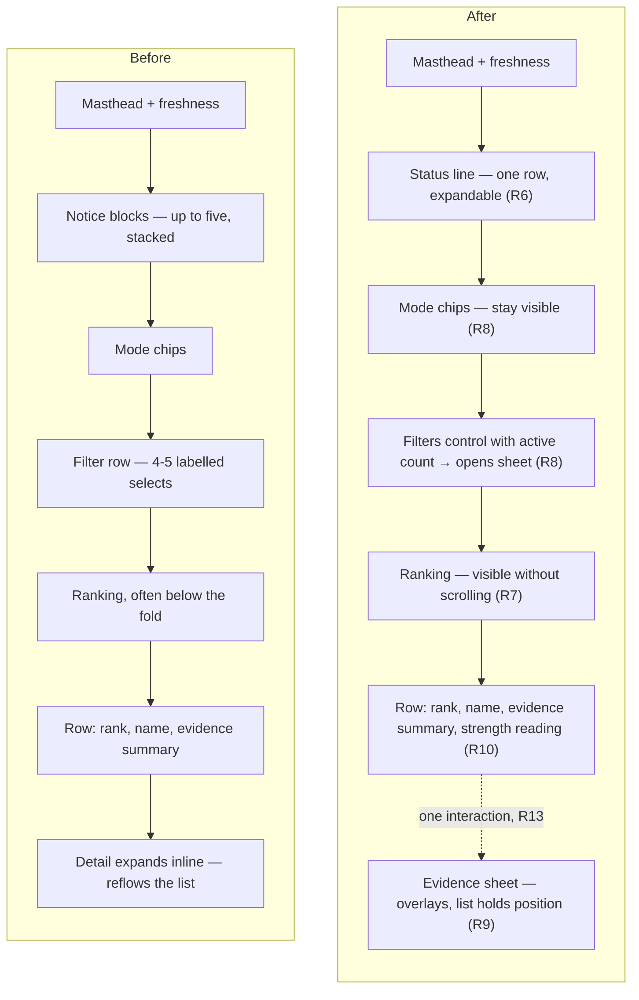
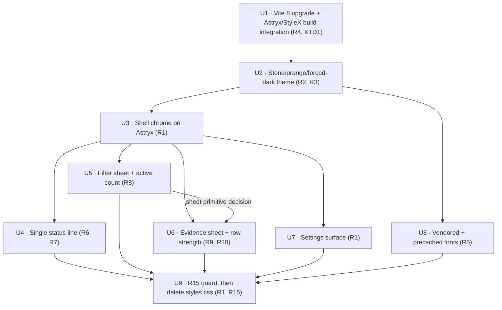

# Astryx Design System Adoption - Plan

## Goal Capsule

- **Objective:** Rebuild the GameRankScout frontend on the Astryx design system — Stone theme, dark mode, orange accent — and take the opportunity to fix four structural weaknesses in the current layout.
- **Product authority:** This plan owns the frontend only. Cloudflare deployment is a settled direction but a separate plan; the ingest, corpus, ranking and worker are untouched.
- **Open blockers:** None. Every decision needed to start planning is settled below.
- **Execution profile:** Incremental migration, component by component, in dependency order (U1–U9). Astryx and the bespoke `src/app/styles.css` coexist only for not-yet-migrated components; the stylesheet is deleted in the final unit once the R15 guard is green. *(session-settled: user-directed — chosen over a single big-bang rebuild: each unit stays independently reviewable and the two-systems overlap is temporary and bounded.)*
- **Product Contract preservation:** Product Contract unchanged. This pass adds the Planning Contract, Implementation Units, Verification Contract, and Definition of Done, and resolves the five deferred-to-planning questions in place.

---

## Product Contract

### Summary

Replace the bespoke stylesheet and hand-rolled controls with Astryx components on a Stone-based dark theme with an orange accent, and restructure the reading surface: notices collapse to one line, narrowing filters move into a sheet, game evidence opens in a sheet instead of an inline accordion, and each ranking row gains a visual reading of its evidence strength.

### Problem Frame

The current interface works and is coherent, but three of its structural choices cost the reader on the surface that matters most — a phone.

Up to five status notices can stack between the masthead and the ranking: offline, failed sources, the first-run intro, momentum-unavailable, and relaxed-timeframe ([`src/app/App.tsx:262-338`](src/app/App.tsx:262)). They stack most densely on a cold open, because that is exactly when the intro notice is unseen. The filter bar adds a row of ranking-mode chips plus a row of four to five labelled selects above the content ([`src/app/filters/FilterBar.tsx`](src/app/filters/FilterBar.tsx)). Together they can push the ranking off the first screen at the moment a new reader is deciding whether the product is worth anything.

Opening a game expands its detail inline inside the list item ([`src/app/views/Ranking.tsx:73-80`](src/app/views/Ranking.tsx:73)), so reading the evidence for a game partway down the ranking reflows everything below it.

And for a product whose output is a ranking, nothing on a row conveys rank strength. Every row is text of the same weight, so the reader cannot see that the top entry is far ahead of the eighth — a signal `crossWindow` already computes ([`src/ranking/magnitude.ts:36`](src/ranking/magnitude.ts:36)).

None of this is a styling problem, which is why a token-only re-theme would leave it in place.

### Key Decisions

- **Adopt Astryx fully rather than re-theming the existing CSS.** The value is consistency for everything built from here on, not this screen. *(session-settled: user-directed — chosen over a token-only re-theme and over a re-skin with no layout change: a shared component vocabulary for future work.)* Governs R1, R6, R7, R8, R9, R10.
- **Stone theme, forced dark, orange accent.** Stone's warm slate base carries an orange accent without fighting it; orange is a highlight, not a wash. *(session-settled: user-directed.)* Governs R2, R3.
- **Remove the bespoke stylesheet rather than layering Astryx over it.** Two styling systems on the same components is how visual inconsistency returns. Governs R1, R15.
- **Accept Astryx's beta API churn.** The system is in public beta; upgrades are absorbed as they land rather than waiting for GA. *(session-settled: user-directed — chosen over deferring adoption: the consistency benefit starts now.)*
- **Layout direction is delegated to implementation.** The four structural changes below are the settled outcomes; their visual composition is not specified here and does not need a further product decision. *(session-settled: user-directed.)* Governs R6, R7, R8, R9, R10.

<!-- ce-section: work-relationships -->
### How This Work Fits Together

This plan owns the frontend rebuild. The breakdown below is how the surrounding work is currently understood, not a committed roadmap.

- Astryx adoption and layout rebuild — this plan.
  - Can proceed independently of the deployment work; nothing here depends on where the app is hosted.
- Cloudflare Pages + Workers deployment — [the deployment plan](docs/plans/2026-08-01-003-ci-cloudflare-deployment-plan.md).
  - Shares [`vite.config.ts`](vite.config.ts) with this plan from a different direction, so the two are cheaper to land in sequence than in parallel.
  - Can proceed independently of this plan; it publishes whatever the build produces.
- Knowledge-store discoverability.
  - Delivered: [`AGENTS.md`](AGENTS.md) now surfaces `docs/solutions/` and [`CONCEPTS.md`](CONCEPTS.md).

### Requirements

**Design system foundation**

- R1. The app renders through Astryx components and theme tokens, and [`src/app/styles.css`](src/app/styles.css) is removed rather than kept underneath them.
- R2. The theme is Stone with the accent token overridden to orange, and the app renders in dark mode regardless of OS preference.
- R3. Orange is reserved for rank emphasis and each view's primary action.
- R4. Both the production build and the vitest suite compile through Astryx's StyleX build integration.
- R5. Stone's typefaces are served from the app's own origin and precached with the rest of the shell, so no runtime request reaches a third-party font host.

**Reading surface**

- R6. Status notices occupy a single collapsed line that the reader can expand, rather than stacking as separate blocks.
- R7. On a cold open on a phone, ranked entries are visible without scrolling.
- R8. The narrowing filters — timeframe, platform, genre, tag, handheld — open in a sheet from a control that shows how many are active; ranking mode stays visible on the main surface.
- R9. A game's evidence opens in a sheet that leaves the ranking's scroll position and row order undisturbed.
- R10. Each ranking row carries a visual reading of its evidence strength, derived from the cross-window presence the ranking already computes.

**Preserved behaviour**

- R11. Every state that is a designed state today — empty, sparse, offline, first-run, momentum-unavailable, filters-exhausted — remains one, with its current copy intact unless the copy names a control that no longer exists.
- R12. Changing filter, mode, or timeframe stays a re-render with no interstitial loading state. Preserves R32 of [the original plan](docs/plans/2026-07-28-001-feat-gamerankscout-plan.md).
- R13. The threads behind a game stay reachable in one interaction from the ranking. Preserves R34 of [the original plan](docs/plans/2026-07-28-001-feat-gamerankscout-plan.md).
- R14. The interface stays operable one-handed on a phone, including filter and mode changes. Preserves R33 of [the original plan](docs/plans/2026-07-28-001-feat-gamerankscout-plan.md).

**Quality guard**

- R15. A replacement guard for R36 of [the original plan](docs/plans/2026-07-28-001-feat-gamerankscout-plan.md) — no reachable route renders unstyled or placeholder chrome — is in place and passing before [`src/app/styles.css`](src/app/styles.css) and [`src/app/styles.test.ts`](src/app/styles.test.ts) are deleted.

### Screen composition

The region change R6 through R9 describe, on the phone surface:

### Key Flows

- F1. Discovery session, reshaped
  - **Trigger:** The reader opens GRS.
  - **Steps:** The app loads the corpus and applies saved selections. Any active status collapses into the single status line. The ranking renders with mode chips and a filters control above it. The reader adjusts mode inline, or opens the filters sheet to narrow. Opening a game raises the evidence sheet over the ranking; dismissing it returns the reader to the same scroll position.
  - **Outcome:** The reader enters a discussion thread, or dismisses a game from future rankings.
  - **Covers R6, R7, R8, R9, R10, R12, R13.**

### Acceptance Examples

- AE1. Cold open with several statuses active
  - **Covers R6, R7, R11.**
  - **Given** a first-run reader who is offline and whose last corpus had a failed source.
  - **When** the app loads on a phone.
  - **Then** one status line reports that multiple statuses are active, ranked entries are visible without scrolling, and expanding the line shows each status with its own copy.

- AE2. Reading evidence partway down the ranking
  - **Covers R9, R13.**
  - **Given** a reader scrolled to the twelfth entry.
  - **When** they open that game's evidence and then dismiss it.
  - **Then** the evidence was one interaction away, the ranking did not reflow while it was open, and the twelfth entry is still under the reader's thumb.

- AE3. Narrowing with the filter sheet
  - **Covers R8, R12, R14.**
  - **Given** a reader with a platform and a genre filter applied.
  - **When** they open the filters control.
  - **Then** it indicates two active filters, the sheet is reachable one-handed, and changing a filter re-renders the ranking with no loading state.

- AE4. Filters that match nothing
  - **Covers R11.**
  - **Given** a filter combination no game satisfies at any timeframe.
  - **When** the ranking renders.
  - **Then** the exhausted state appears as a designed state with its copy and a reset action, not as an empty list.

### Scope Boundaries

**Deferred for later**

- Cloudflare Pages + Workers deployment — direction settled, separate plan.
- A light mode. The app is dark-only today and stays dark-only here.
- New filters, ranking modes, or changes to what the ranking computes.

**Outside this work**

- The ingest, corpus schema, extraction, and the on-demand community worker. Nothing in this plan changes what data reaches the app.
- The copy of existing designed states, on the terms R11 sets.

**Deferred to Follow-Up Work**

- A bundle-size budget check alongside the existing guards. Worth measuring Astryx's real contribution once the migration has landed, not before.

### Dependencies and Assumptions

- Astryx requires React 19 or newer; the app is on React 19.1, so no React upgrade is implied.
- Astryx is MIT-licensed and in public beta. The public API is expected to move.
- Astryx builds on StyleX and ships a Vite build plugin. [`vite.config.ts`](vite.config.ts) also configures vitest, so the plugin must not break test compilation — assumed workable, unverified.
- The existing UI tests query by role and accessible name rather than class names or DOM structure, so most survive the rebuild. Queries tied to interactions that change — the inline detail region becoming a sheet — will need updating.
- Astryx's bundle contribution is unmeasured. The app already ships a 3.4 MB corpus and precaches a shell.

### Outstanding Questions

**Resolve before planning**

- None.

**Resolved during planning**

- *What replaces [`src/app/styles.test.ts`](src/app/styles.test.ts) as the R36 guard.* → A render-based smoke guard (U9): mount each reachable state and assert themed chrome is present and no element carries a leftover bespoke class from the removed stylesheet. The current static class-coverage check is meaningless once StyleX owns class names. See **U9**.
- *Whether Astryx's overlay primitive supports a bottom-anchored sheet, or the sheet must be composed.* → Execution-time discovery with a fallback: use Astryx's overlay/dialog primitive if it anchors bottom; otherwise compose the sheet from it. Decided once, in U5, and reused by U6. See **U5**.
- *How Stone's typefaces are vendored and precached (R5).* → Vendor the exact Stone faces under [`public/fonts/`](public/), declare them with `@font-face` using a local `src`, and extend the workbox `globPatterns` in [`vite.config.ts`](vite.config.ts) to include `woff2`/`woff` (today it covers only `js,css,html,svg,png,webmanifest`). See **U8**.
- *Whether the StyleX plugin needs a separate vitest configuration.* → Prefer the single shared [`vite.config.ts`](vite.config.ts) that already drives both build and vitest. Only split the test transform if the plugin proves Rollup-only under vitest — retired first, in U1. See **U1**.
- *Whether a bundle budget is worth adding.* → Deferred to follow-up work (see Scope Boundaries); Astryx's bundle contribution is best measured after the migration lands.

### Sources

- [Astryx getting started](https://astryx.atmeta.com/docs/getting-started) and [theme system](https://astryx.atmeta.com/docs/theme) — theme presets, `defineTheme`, `[light, dark]` token tuples, the `mode` prop, and the `astryx theme` CLI.
- [facebook/astryx](https://github.com/facebook/astryx) — MIT licence, beta status, package split including `@astryxdesign/build`.
- [The original plan](docs/plans/2026-07-28-001-feat-gamerankscout-plan.md) — R31 through R36 and D13 are the experience-quality requirements this work must keep satisfying.
- Current frontend: [`src/app/App.tsx`](src/app/App.tsx), [`src/app/views/Ranking.tsx`](src/app/views/Ranking.tsx), [`src/app/views/GameDetail.tsx`](src/app/views/GameDetail.tsx), [`src/app/filters/FilterBar.tsx`](src/app/filters/FilterBar.tsx), [`src/app/settings/`](src/app/settings/), [`src/app/styles.css`](src/app/styles.css) — 1,154 lines of components and 729 lines of CSS.

---

## Planning Contract

### Research summary

- **The frontend queries by role and accessible name, not class or DOM shape.** [`src/app/states.test.tsx`](src/app/states.test.tsx) and [`src/app/views/Ranking.test.tsx`](src/app/views/Ranking.test.tsx) find controls with `getByRole`/`findByRole` and text matchers. Most tests survive the rebuild untouched; the ones that break are those tied to the two interactions that *change shape* — the inline detail region becoming an evidence sheet (`states.test.tsx` thread assertion, and Ranking's expand test).
- **The R10 strength signal already exists on every row.** `applyRanking` returns `RankedGame[]`, each carrying `components.magnitude` ([`src/ranking/score.ts`](src/ranking/score.ts)), the per-game average of the cross-window thread magnitude computed in [`src/ranking/magnitude.ts:36`](src/ranking/magnitude.ts:36). `MAX_MAGNITUDE` ([`src/ranking/magnitude.ts:49`](src/ranking/magnitude.ts:49)) is the normaliser. No ranking-math change is needed — R10 is a read of data already flowing into the view.
- **The PWA precache has no font coverage today.** [`vite.config.ts:14`](vite.config.ts:14) sets `globPatterns: ['**/*.{js,css,html,svg,png,webmanifest}']` — no `woff2`. R5 is a real gap, not a no-op.
- **`vite.config.ts` is shared by build and vitest.** The same file configures the Vite build and the vitest suite ([`vite.config.ts:35-58`](vite.config.ts:35)). Any Astryx/StyleX build plugin must transform test modules too, which is why R4 is the first risk retired (U1).
- **Adopting Astryx forces a Vite 6 → 8 double-major upgrade** *(discovered during U1 implementation, 2026-08-07)*. `@astryxdesign/build@0.3.0` declares a hard peer `vite: ^8.1.3`; the repo is on Vite 6.4.3. This cascades: `vitest` 3.2.7 → 4.x (v3 does not support Vite 8; v4 peer is `^6 || ^7 || ^8`), `@vitejs/plugin-react` 4.7.0 → 6.x (v6 peer `vite ^8.0.0`), and `vite-plugin-pwa` 0.21.2 → 1.3.0. The StyleX toolchain adds `@stylexjs/stylex ^0.19`, `@stylexjs/unplugin`, `@stylexjs/babel-plugin`, and `@babel/core`. `@astryxdesign/core@0.3.0` peers React `>=19.0.0`, so React 19.1 is unaffected. This is the single largest risk in the plan and is why U1 upgrades-and-verifies the toolchain in isolation *before* introducing Astryx.
- **The Vite upgrade touches deployed infrastructure.** [`vite.config.ts`](vite.config.ts) and the vite-plugin-pwa service-worker config are shared with the already-merged [Cloudflare deployment plan](docs/plans/2026-08-01-003-ci-cloudflare-deployment-plan.md). A Vite 8 + vite-plugin-pwa 1.x bump changes the build that produces `dist/` and the service worker in production, so U1's verification must confirm `vite build` still emits a working `dist/` and precache manifest, not only that tests pass.

### Key Technical Decisions

- **KTD1. Upgrade the Vite toolchain to Vite 8 to adopt Astryx, rather than pinning Astryx to a Vite-6-compatible release.** No Vite-6-compatible Astryx build plugin exists — the peer is strict `^8.1.3` — so adoption (a session-settled Key Decision) *requires* the upgrade. Do the toolchain bump and verify the existing suite and build are green in isolation before adding Astryx, so a green-to-red transition is unambiguously attributable to one change or the other. *(Chosen over peer-override hacks against Vite 6: the plugin targets Vite 8 build APIs and an override would fail at build time, not just install.)* Governs R4.
- **The R36 guard is a static text scan.** [`src/app/styles.test.ts`](src/app/styles.test.ts) reads `styles.css` and asserts every rendered class has a rule. Once StyleX owns class names this check is vacuous — R15 needs a render-based replacement.
- **Institutional learnings:** [`docs/solutions/security-issues/fixture-sanitisation-check-covered-one-file.md`](docs/solutions/security-issues/fixture-sanitisation-check-covered-one-file.md) — a guard that scans a fixed file set silently stops covering new files; the U9 replacement guard must self-check that it actually exercises what it claims to (mirroring the "finds the components it is meant to be checking" test in the current `styles.test.ts`).

### Patterns to follow

- Keep every control queryable by role and accessible name; preserve `aria-label`, `aria-pressed`, `role="status"`, and existing copy so the state-matrix tests stay meaningful.
- Mirror the `set(patch)` re-render pattern in [`src/app/filters/FilterBar.tsx:28`](src/app/filters/FilterBar.tsx:28) — filter changes stay pure recomputes, never fetches (R12).
- Reuse the state matrix in [`src/app/states.test.tsx`](src/app/states.test.tsx) as the source of "every reachable state" for the U9 guard.

### Execution direction

Smoke-first, then incremental. U1 proves one Astryx component renders under both `vite build` and vitest before any real UI is migrated. Each subsequent unit migrates a bounded surface, keeps the suite green, and leaves `styles.css` in place until U9. The R15 guard must be green *before* the stylesheet is deleted, within U9.

### Astryx API caveat

Astryx is in public beta and its API is expected to move (a settled Key Decision). The component and primitive names below (overlay/sheet, provider, button) are referenced by role, not pinned to exact export names — resolve the current names against the installed package during U1–U3. Where a specific primitive's capability is uncertain (bottom-anchored sheet), the plan carries an explicit fallback rather than assuming.

---

## High-Level Technical Design

Unit dependency order. U1 (build integration) and U2 (theme) are the foundation everything else builds on; U9 (guard + stylesheet deletion) closes only after every UI surface is migrated.

---

## Implementation Units

### U1. Vite 8 toolchain upgrade and Astryx/StyleX build integration

- **Goal:** Upgrade the Vite toolchain to the versions Astryx requires, verify the existing suite and build stay green, then install Astryx and wire its StyleX build plugin into [`vite.config.ts`](vite.config.ts) so both `vite build` and `vitest run` compile through it.
- **Requirements:** R4. Governed by **KTD1**. *(session-settled Key Decision: accept beta API churn.)*
- **Dependencies:** none. (Blast radius: shares [`vite.config.ts`](vite.config.ts) and the PWA config with the merged deployment plan — verify the built `dist/` and service worker still work.)
- **Files:** [`package.json`](package.json), [`package-lock.json`](package-lock.json), [`vite.config.ts`](vite.config.ts), [`tsconfig.json`](tsconfig.json) (if type/path wiring is needed), [`test/setup.ts`](test/setup.ts) (only if the test transform needs it), new [`src/app/astryx-smoke.test.tsx`](src/app/).
- **Approach (two stages — do not combine; verify green between them):**
  1. **Toolchain upgrade first, no Astryx.** Bump `vite` 6→8, `vitest` 3→4, `@vitejs/plugin-react` 4→6, `vite-plugin-pwa` 0.21→1.3. Absorb the vitest 4, plugin-react 6, and vite-plugin-pwa 1.x breaking-change fallout in [`vite.config.ts`](vite.config.ts) and any test setup. Confirm `npm run lint`, `npm test`, and `vite build` are all green with the existing bespoke UI untouched — this isolates the upgrade from Astryx so any regression is attributable.
  2. **Then add Astryx.** Install `@astryxdesign/core@^0.3`, `@astryxdesign/build@^0.3`, and the StyleX peers (`@stylexjs/stylex ^0.19`, `@stylexjs/unplugin`, `@stylexjs/babel-plugin`, `@babel/core`). Register the Astryx/StyleX Vite plugin in `plugins` (order per its docs relative to `react()`). Confirm the same shared config transforms modules under vitest; only introduce a separate vitest transform if the plugin proves Rollup-only at test time.
- **Execution note:** Smoke-first, and stage-gated — get the toolchain green before Astryx, then land one Astryx primitive rendering in both `vite build` and a vitest test before any real UI is migrated (U2+).
- **Patterns to follow:** the existing plugin registration and `test` block in [`vite.config.ts:6-58`](vite.config.ts:6).
- **Test scenarios:**
  - After stage 1: the full existing suite passes unchanged on Vite 8 / vitest 4 — proves the upgrade is behavior-neutral.
  - After stage 2: a vitest test renders a single Astryx primitive (e.g. a button) and finds it by role — proves the StyleX transform runs under vitest (the R4 proof at test level; the build-level proof is in the Verification Contract).
- **Verification:** `npm run lint` clean; `npm test` green; `vite build` completes, emits StyleX-generated CSS, and produces a working `dist/` with its service-worker precache manifest intact (deployment blast-radius check).

### U2. Stone/orange/forced-dark theme

- **Goal:** Define the theme — Stone preset, accent token overridden to orange, `[light, dark]` tuples — and force dark mode at the root regardless of OS preference.
- **Requirements:** R2, R3. *(session-settled KTD: Stone, forced dark, orange accent.)*
- **Dependencies:** U1.
- **Files:** new [`src/app/theme.ts`](src/app/), [`src/app/main.tsx`](src/app/main.tsx), new [`src/app/theme.test.ts`](src/app/).
- **Approach:** Use `defineTheme` on the Stone preset, overriding the accent token to orange. Wrap the app in the Astryx provider with `mode="dark"` set unconditionally. Orange is a usage rule (rank emphasis + each view's primary action, R3) enforced in U4/U5/U6; U2 only makes it the accent token.
- **Patterns to follow:** the root render in [`src/app/main.tsx`](src/app/main.tsx).
- **Test scenarios:**
  - The theme module exports a defined theme whose accent token is the orange value.
  - The rendered root carries dark mode (assert the mode attribute/class Astryx applies).
  - *Test expectation for light mode: none — dark-only by design (R2).*
- **Verification:** app renders in dark mode with the orange accent in the browser check.

### U3. Shell chrome on Astryx

- **Goal:** Replace the bespoke `.app`, `.masthead`, `.state`, `.button`, `.icon-button`, and `.link-button` chrome with Astryx components, keeping all copy and accessible names.
- **Requirements:** R1 (partial), R11.
- **Dependencies:** U2.
- **Files:** [`src/app/App.tsx`](src/app/App.tsx), [`src/app/views/ExternalLink.tsx`](src/app/views/ExternalLink.tsx), [`src/app/states.test.tsx`](src/app/states.test.tsx) (kept; adjust only if a name would otherwise change — it must not).
- **Approach:** Swap layout containers, buttons, and the masthead for Astryx equivalents. Preserve `aria-label="Settings"`, the "Try again" button, and every state heading and paragraph verbatim. Do not touch notice stacking (U4), filters (U5), or the ranking (U6) yet — `styles.css` still styles those.
- **Patterns to follow:** the role/accessible-name queries in [`src/app/states.test.tsx`](src/app/states.test.tsx).
- **Test scenarios:**
  - `states.test.tsx` passes unchanged for the loading, empty, offline-nothing-cached, offline-with-cache, and warm-service-worker states — copy and roles intact (R11).
  - The settings icon-button still exposes the accessible name "Settings".
- **Verification:** `npm test` green; shell renders themed in the browser check.

### U4. Single expandable status line

- **Goal:** Replace the up-to-five stacked `.notice` blocks with one collapsed line that reports how many statuses are active and expands to each status with its own copy (R6). This is the primary contributor to R7.
- **Requirements:** R6, R7, R11.
- **Dependencies:** U3.
- **Files:** [`src/app/App.tsx`](src/app/App.tsx), new [`src/app/views/StatusLine.tsx`](src/app/views/) and [`src/app/views/StatusLine.test.tsx`](src/app/views/), [`src/app/states.test.tsx`](src/app/states.test.tsx) (update the multi-status assertions to the expand interaction).
- **Approach:** Collect the active statuses — offline/cache, failed sources, first-run intro, momentum-unavailable, relaxed-timeframe — into a list. Render one line when ≥1 is active, showing the count; expanding reveals each with its existing copy verbatim. Preserve `role="status"` on the momentum and relaxed-timeframe messages and the intro's "Got it" dismissal (which must still persist across a remount via `introSeen`).
- **Execution note:** Preserve each status's exact copy; `states.test.tsx` is the regression guard.
- **Patterns to follow:** the current notice JSX in [`src/app/App.tsx:269-345`](src/app/App.tsx:269).
- **Test scenarios:**
  - *Covers AE1.* First-run reader, offline, with a failed source → one line reports multiple statuses active; expanding it shows each status with its own copy.
  - A single active status still collapses to one expandable row.
  - Zero active statuses → no status line renders.
  - The intro "Got it" dismisses the intro and it stays dismissed after a remount.
  - momentum-unavailable and relaxed-timeframe messages retain `role="status"`.
- **Verification:** `npm test` green; on a phone viewport the status line is one row (feeds R7's browser check).

### U5. Filter sheet with active count

- **Goal:** Split the filter bar — mode chips stay on the main surface; the narrowing filters (timeframe, platform, genre, tag, handheld) move into a sheet opened from a control that shows how many are active (R8).
- **Requirements:** R8, R12, R14.
- **Dependencies:** U3. *(First use of the sheet primitive — resolve overlay-vs-composed here; U6 reuses the decision.)*
- **Files:** [`src/app/filters/FilterBar.tsx`](src/app/filters/FilterBar.tsx) (split into mode chips + trigger), new [`src/app/filters/FiltersSheet.tsx`](src/app/filters/) and [`src/app/filters/FiltersSheet.test.tsx`](src/app/filters/), [`src/app/App.tsx`](src/app/App.tsx), [`src/app/filters/FilterBar.test.tsx`](src/app/filters/FilterBar.test.tsx) (update).
- **Approach:** Mode chips render as pressable controls with `aria-pressed`, on the main surface. A "Filters" control shows the count of non-default narrowing filters and opens a sheet. Use Astryx's overlay/dialog primitive if it supports a bottom-anchored sheet; otherwise compose the sheet from it — decide once here. Filter changes stay pure re-renders (R12) via the existing `set(patch)` helper. Preserve the rule that switching platform away from `pc` clears `handheldOnly`, and that the handheld toggle only appears when platform is `pc`.
- **Technical design (directional):** active count = number of narrowing filters whose value differs from `DEFAULT_FILTERS`; mode is excluded (it lives on the surface, not the sheet).
- **Patterns to follow:** the `set` helper and handheld-drop logic in [`src/app/filters/FilterBar.tsx:28-116`](src/app/filters/FilterBar.tsx:28).
- **Test scenarios:**
  - *Covers AE3.* Platform + genre applied → the control indicates 2 active; opening it reveals the sheet; changing a filter re-renders the ranking with no loading state (R12).
  - Active count is 0 when all narrowing filters are at their defaults.
  - Mode chips stay on the main surface and toggle the mode (`aria-pressed`).
  - Switching platform away from `pc` clears `handheldOnly`.
  - The sheet is dismissable and reachable by keyboard (R14 proxy — tab/enter).
  - *Covers AE4.* A filter combination no game satisfies at any timeframe still renders the designed exhausted state — its copy and the "Reset filters" action — not an empty list (R11).
- **Verification:** `npm test` green; sheet opens one-handed on a phone viewport in the browser check.

### U6. Evidence sheet and per-row strength reading

- **Goal:** Replace the inline expand in the ranking with an evidence sheet that leaves scroll position and row order undisturbed (R9), and add a per-row visual reading of evidence strength derived from magnitude (R10).
- **Requirements:** R9, R10, R13.
- **Dependencies:** U3, U5 (sheet-primitive decision).
- **Files:** [`src/app/views/Ranking.tsx`](src/app/views/Ranking.tsx), [`src/app/views/GameDetail.tsx`](src/app/views/GameDetail.tsx) (content unchanged, rehosted in the sheet), new [`src/app/views/EvidenceSheet.tsx`](src/app/views/) and [`src/app/views/EvidenceSheet.test.tsx`](src/app/views/), [`src/app/views/Ranking.test.tsx`](src/app/views/Ranking.test.tsx) (update inline-region → sheet), [`src/app/states.test.tsx`](src/app/states.test.tsx) (update the thread-reachability assertion at [`src/app/states.test.tsx:222`](src/app/states.test.tsx:222)).
- **Approach:** Each `Entry` row's primary control opens the evidence sheet — still one interaction from the ranking (R13). `GameDetail`'s content moves into the sheet body unchanged. The ranking list must not reflow while the sheet is open (R9). Add a compact strength reading per row derived from `entry.components.magnitude` normalised against `MAX_MAGNITUDE` ([`src/ranking/magnitude.ts:49`](src/ranking/magnitude.ts:49)); give it an accessible label so it is not decoration-only. Keep the primary store link on the row.
- **Technical design (directional):** `strength = clamp(entry.components.magnitude / MAX_MAGNITUDE, 0, 1)`, mapped to a small number of discrete bands for the visual (e.g. filled pips or a bar). Read-only — no ranking-math change.
- **Patterns to follow:** the `Entry` component and `evidenceSummary` in [`src/app/views/Ranking.tsx:31-83`](src/app/views/Ranking.tsx:31); `GameDetail` in [`src/app/views/GameDetail.tsx`](src/app/views/GameDetail.tsx).
- **Test scenarios:**
  - *Covers AE2.* Open an entry's evidence and dismiss it → evidence was one interaction away, the ranking did not reflow while open, and the same entry is still present.
  - *Covers R13.* Thread links are reachable in one interaction from the ranking (the `states.test.tsx` thread assertion, updated to the sheet).
  - A game with higher `components.magnitude` renders a stronger reading than one with lower; the reading carries an accessible label.
  - The evidence sheet renders `GameDetail` content intact — facts, tags, threads, and the "hide this game" dismiss action, which still calls `onDismiss`.
  - Empty ranking still shows the designed "Nothing ranked here" state.
- **Verification:** `npm test` green; on a phone viewport, opening evidence keeps the list scroll position (browser check for AE2).

### U7. Settings surface on Astryx

- **Goal:** Rebuild the settings surface — [`Settings.tsx`](src/app/settings/Settings.tsx), [`Communities.tsx`](src/app/settings/Communities.tsx), [`Sources.tsx`](src/app/settings/Sources.tsx) — on Astryx components, removing their bespoke classes (R1).
- **Requirements:** R1, R11.
- **Dependencies:** U3.
- **Files:** [`src/app/settings/Settings.tsx`](src/app/settings/Settings.tsx), [`src/app/settings/Communities.tsx`](src/app/settings/Communities.tsx), [`src/app/settings/Sources.tsx`](src/app/settings/Sources.tsx), new [`src/app/settings/Settings.test.tsx`](src/app/settings/) if no settings test currently exists.
- **Approach:** Swap containers, controls, and buttons for Astryx equivalents while preserving accessible names and the `onChange`/`onPull`/`onClose` contracts and all copy. No behaviour change — this is a re-theme.
- **Patterns to follow:** the settings branch in [`src/app/App.tsx:237-250`](src/app/App.tsx:237); reader-state shape in [`src/app/state/local.ts`](src/app/state/local.ts).
- **Test scenarios:**
  - Settings open via the "Settings" control and close via its close control (by role/name).
  - Toggling a source and adding/removing a community behave as before (query by role/name), confirming the reader-state contracts are intact.
- **Verification:** `npm test` green; settings surface renders themed in the browser check.

### U8. Vendored and precached fonts

- **Goal:** Serve Stone's typefaces from the app's own origin and add them to the PWA precache so no runtime request reaches a third-party font host (R5).
- **Requirements:** R5.
- **Dependencies:** U2 (the theme references the faces).
- **Files:** new [`public/fonts/`](public/) (vendored `woff2` faces), the `@font-face` declarations (in [`src/app/theme.ts`](src/app/) or a dedicated `fonts.css`), [`vite.config.ts`](vite.config.ts) (extend `globPatterns` and `includeAssets`), new [`src/app/fonts.test.ts`](src/app/).
- **Approach:** Vendor the exact Stone faces under `public/fonts/`, declare them with `@font-face` using a local `src`, and extend the workbox `globPatterns` in [`vite.config.ts:14`](vite.config.ts:14) to include `woff2` (and `woff` if used). Confirm no external font-host URL remains anywhere in the theme or CSS.
- **Patterns to follow:** the `includeAssets` / `globPatterns` config in [`vite.config.ts:12-14`](vite.config.ts:12).
- **Test scenarios:**
  - A test asserts `globPatterns` includes `woff2` and that no theme/CSS source references an external font host.
  - *Test expectation for runtime precache behaviour: none at unit level — verified in the browser/network check (R5).*
- **Verification:** `vite build` includes the vendored fonts in `dist`; the browser network panel shows no third-party font request (R5).

### U9. R15 guard, then delete the bespoke stylesheet

- **Goal:** Stand up the replacement no-unstyled-chrome guard (R15), confirm it passes, then remove [`src/app/styles.css`](src/app/styles.css) and [`src/app/styles.test.ts`](src/app/styles.test.ts) and the stylesheet import.
- **Requirements:** R1, R15.
- **Dependencies:** U3, U4, U5, U6, U7, U8 (all UI surfaces migrated).
- **Files:** new [`src/app/styling.test.tsx`](src/app/) (render-based guard), remove [`src/app/styles.css`](src/app/styles.css), remove [`src/app/styles.test.ts`](src/app/styles.test.ts), [`src/app/main.tsx`](src/app/main.tsx) (drop the `styles.css` import).
- **Approach:** Replace the static class-coverage check with a render-based guard: mount each reachable state (reuse the `states.test.tsx` matrix) and assert each mounts themed chrome and carries no leftover bespoke class from the removed vocabulary. Only once the guard is green, delete `styles.css` and `styles.test.ts` and remove the import.
- **Execution note:** The guard must be green *before* the deletion, within this unit — the ordering is the whole point of R15.
- **Patterns to follow:** the "finds the components it is meant to be checking" self-check in [`src/app/styles.test.ts:79-84`](src/app/styles.test.ts:79); the state matrix in [`src/app/states.test.tsx`](src/app/states.test.tsx); the coverage-drift lesson in [`docs/solutions/security-issues/fixture-sanitisation-check-covered-one-file.md`](docs/solutions/security-issues/fixture-sanitisation-check-covered-one-file.md).
- **Test scenarios:**
  - The guard renders the loading, empty, offline, first-run, momentum-unavailable, and filters-exhausted states and asserts each mounts themed chrome (the standing R11/R15 guard).
  - The guard fails if a component still emits a legacy bespoke class — a self-check proving it is not vacuous.
  - After deletion, the full suite passes with no reference to `styles.css`.
- **Verification:** `npm test` green with the new guard; `styles.css` and `styles.test.ts` gone; `grep` for the old class vocabulary finds nothing reachable.

---

## Verification Contract

- `npm run lint` (`tsc --noEmit && eslint .`) is clean.
- `npm test` is green — the suite compiles through Astryx's StyleX transform (on vitest 4 / Vite 8), which is itself the test-level proof of R4.
- `vite build` succeeds on Vite 8, emits StyleX-generated CSS, includes the vendored fonts in `dist`, and produces a service-worker precache manifest — confirming the Vite 8 / vite-plugin-pwa 1.x upgrade did not regress the deployed build (KTD1 blast radius).
- Browser check on a phone viewport (per [the deployment/preview setup](docs/plans/2026-08-01-003-ci-cloudflare-deployment-plan.md) or `npm run dev`):
  - Forced dark mode with the orange accent, regardless of OS preference (R2, R3).
  - Cold open: ranked entries visible without scrolling (R7); the status line is one expandable row (R6).
  - The filters control shows the active count and opens a sheet reachable one-handed (R8, R14).
  - Opening a game's evidence raises a sheet and leaves the ranking's scroll position and row order undisturbed (R9); each row shows its strength reading (R10).
  - The network panel shows no request to a third-party font host (R5).

---

## Definition of Done

- R1–R15 are satisfied; the four structural changes (single status line, filter sheet, evidence sheet, per-row strength reading) are in place.
- [`src/app/styles.css`](src/app/styles.css) and [`src/app/styles.test.ts`](src/app/styles.test.ts) are removed, and the R15 render-based guard is passing.
- Every state that was a designed state remains one, with its copy intact (R11).
- The Verification Contract passes end to end, including the phone-viewport browser check.
