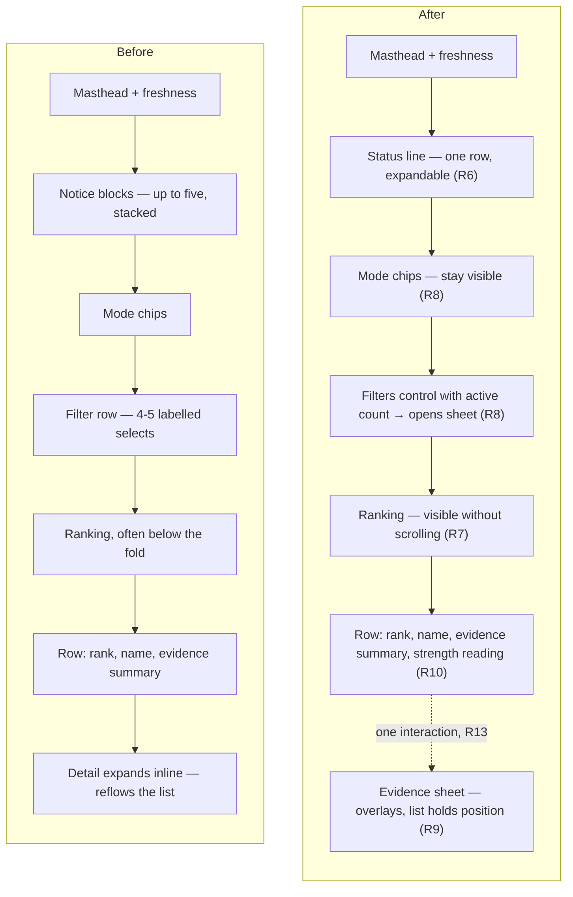

# Astryx Design System Adoption - Plan

## Goal Capsule

- **Objective:** Rebuild the GameRankScout frontend on the Astryx design system — Stone theme, dark mode, orange accent — and take the opportunity to fix four structural weaknesses in the current layout.
- **Product authority:** This plan owns the frontend only. Cloudflare deployment is a settled direction but a separate plan; the ingest, corpus, ranking and worker are untouched.
- **Open blockers:** None. Every decision needed to start planning is settled below.

---

## Product Contract

### Summary

Replace the bespoke stylesheet and hand-rolled controls with Astryx components on a Stone-based dark theme with an orange accent, and restructure the reading surface: notices collapse to one line, narrowing filters move into a sheet, game evidence opens in a sheet instead of an inline accordion, and each ranking row gains a visual reading of its evidence strength.

### Problem Frame

The current interface works and is coherent, but three of its structural choices cost the reader on the surface that matters most — a phone.

Up to five status notices can stack between the masthead and the ranking: offline, failed sources, the first-run intro, momentum-unavailable, and relaxed-timeframe ([`src/app/App.tsx:262-338`](src/app/App.tsx:262)). They stack most densely on a cold open, because that is exactly when the intro notice is unseen. The filter bar adds a row of ranking-mode chips plus a row of four to five labelled selects above the content ([`src/app/filters/FilterBar.tsx`](src/app/filters/FilterBar.tsx)). Together they can push the ranking off the first screen at the moment a new reader is deciding whether the product is worth anything.

Opening a game expands its detail inline inside the list item ([`src/app/views/Ranking.tsx:73-80`](src/app/views/Ranking.tsx:73)), so reading the evidence for a game partway down the ranking reflows everything below it.

And for a product whose output is a ranking, nothing on a row conveys rank strength. Every row is text of the same weight, so the reader cannot see that the top entry is far ahead of the eighth — a signal `crossWindow` already computes ([`src/ranking/magnitude.ts:36`](src/ranking/magnitude.ts:36)).

None of this is a styling problem, which is why a token-only re-theme would leave it in place.

### Key Decisions

- **Adopt Astryx fully rather than re-theming the existing CSS.** The value is consistency for everything built from here on, not this screen. *(session-settled: user-directed — chosen over a token-only re-theme and over a re-skin with no layout change: a shared component vocabulary for future work.)* Governs R1, R6, R7, R8, R9, R10.
- **Stone theme, forced dark, orange accent.** Stone's warm slate base carries an orange accent without fighting it; orange is a highlight, not a wash. *(session-settled: user-directed.)* Governs R2, R3.
- **Remove the bespoke stylesheet rather than layering Astryx over it.** Two styling systems on the same components is how visual inconsistency returns. Governs R1, R15.
- **Accept Astryx's beta API churn.** The system is in public beta; upgrades are absorbed as they land rather than waiting for GA. *(session-settled: user-directed — chosen over deferring adoption: the consistency benefit starts now.)*
- **Layout direction is delegated to implementation.** The four structural changes below are the settled outcomes; their visual composition is not specified here and does not need a further product decision. *(session-settled: user-directed.)* Governs R6, R7, R8, R9, R10.

<!-- ce-section: work-relationships -->
### How This Work Fits Together

This plan owns the frontend rebuild. The breakdown below is how the surrounding work is currently understood, not a committed roadmap.

- Astryx adoption and layout rebuild — this plan.
  - Can proceed independently of the deployment work; nothing here depends on where the app is hosted.
- Cloudflare Pages + Workers deployment — [the deployment plan](docs/plans/2026-08-01-003-ci-cloudflare-deployment-plan.md).
  - Shares [`vite.config.ts`](vite.config.ts) with this plan from a different direction, so the two are cheaper to land in sequence than in parallel.
  - Can proceed independently of this plan; it publishes whatever the build produces.
- Knowledge-store discoverability.
  - Delivered: [`AGENTS.md`](AGENTS.md) now surfaces `docs/solutions/` and [`CONCEPTS.md`](CONCEPTS.md).

### Requirements

**Design system foundation**

- R1. The app renders through Astryx components and theme tokens, and [`src/app/styles.css`](src/app/styles.css) is removed rather than kept underneath them.
- R2. The theme is Stone with the accent token overridden to orange, and the app renders in dark mode regardless of OS preference.
- R3. Orange is reserved for rank emphasis and each view's primary action.
- R4. Both the production build and the vitest suite compile through Astryx's StyleX build integration.
- R5. Stone's typefaces are served from the app's own origin and precached with the rest of the shell, so no runtime request reaches a third-party font host.

**Reading surface**

- R6. Status notices occupy a single collapsed line that the reader can expand, rather than stacking as separate blocks.
- R7. On a cold open on a phone, ranked entries are visible without scrolling.
- R8. The narrowing filters — timeframe, platform, genre, tag, handheld — open in a sheet from a control that shows how many are active; ranking mode stays visible on the main surface.
- R9. A game's evidence opens in a sheet that leaves the ranking's scroll position and row order undisturbed.
- R10. Each ranking row carries a visual reading of its evidence strength, derived from the cross-window presence the ranking already computes.

**Preserved behaviour**

- R11. Every state that is a designed state today — empty, sparse, offline, first-run, momentum-unavailable, filters-exhausted — remains one, with its current copy intact unless the copy names a control that no longer exists.
- R12. Changing filter, mode, or timeframe stays a re-render with no interstitial loading state. Preserves R32 of [the original plan](docs/plans/2026-07-28-001-feat-gamerankscout-plan.md).
- R13. The threads behind a game stay reachable in one interaction from the ranking. Preserves R34 of [the original plan](docs/plans/2026-07-28-001-feat-gamerankscout-plan.md).
- R14. The interface stays operable one-handed on a phone, including filter and mode changes. Preserves R33 of [the original plan](docs/plans/2026-07-28-001-feat-gamerankscout-plan.md).

**Quality guard**

- R15. A replacement guard for R36 of [the original plan](docs/plans/2026-07-28-001-feat-gamerankscout-plan.md) — no reachable route renders unstyled or placeholder chrome — is in place and passing before [`src/app/styles.css`](src/app/styles.css) and [`src/app/styles.test.ts`](src/app/styles.test.ts) are deleted.

### Screen composition

The region change R6 through R9 describe, on the phone surface:

### Key Flows

- F1. Discovery session, reshaped
  - **Trigger:** The reader opens GRS.
  - **Steps:** The app loads the corpus and applies saved selections. Any active status collapses into the single status line. The ranking renders with mode chips and a filters control above it. The reader adjusts mode inline, or opens the filters sheet to narrow. Opening a game raises the evidence sheet over the ranking; dismissing it returns the reader to the same scroll position.
  - **Outcome:** The reader enters a discussion thread, or dismisses a game from future rankings.
  - **Covers R6, R7, R8, R9, R10, R12, R13.**

### Acceptance Examples

- AE1. Cold open with several statuses active
  - **Covers R6, R7, R11.**
  - **Given** a first-run reader who is offline and whose last corpus had a failed source.
  - **When** the app loads on a phone.
  - **Then** one status line reports that multiple statuses are active, ranked entries are visible without scrolling, and expanding the line shows each status with its own copy.

- AE2. Reading evidence partway down the ranking
  - **Covers R9, R13.**
  - **Given** a reader scrolled to the twelfth entry.
  - **When** they open that game's evidence and then dismiss it.
  - **Then** the evidence was one interaction away, the ranking did not reflow while it was open, and the twelfth entry is still under the reader's thumb.

- AE3. Narrowing with the filter sheet
  - **Covers R8, R12, R14.**
  - **Given** a reader with a platform and a genre filter applied.
  - **When** they open the filters control.
  - **Then** it indicates two active filters, the sheet is reachable one-handed, and changing a filter re-renders the ranking with no loading state.

- AE4. Filters that match nothing
  - **Covers R11.**
  - **Given** a filter combination no game satisfies at any timeframe.
  - **When** the ranking renders.
  - **Then** the exhausted state appears as a designed state with its copy and a reset action, not as an empty list.

### Scope Boundaries

**Deferred for later**

- Cloudflare Pages + Workers deployment — direction settled, separate plan.
- A light mode. The app is dark-only today and stays dark-only here.
- New filters, ranking modes, or changes to what the ranking computes.

**Outside this work**

- The ingest, corpus schema, extraction, and the on-demand community worker. Nothing in this plan changes what data reaches the app.
- The copy of existing designed states, on the terms R11 sets.

### Dependencies and Assumptions

- Astryx requires React 19 or newer; the app is on React 19.1, so no React upgrade is implied.
- Astryx is MIT-licensed and in public beta. The public API is expected to move.
- Astryx builds on StyleX and ships a Vite build plugin. [`vite.config.ts`](vite.config.ts) also configures vitest, so the plugin must not break test compilation — assumed workable, unverified.
- The existing UI tests query by role and accessible name rather than class names or DOM structure, so most survive the rebuild. Queries tied to interactions that change — the inline detail region becoming a sheet — will need updating.
- Astryx's bundle contribution is unmeasured. The app already ships a 3.4 MB corpus and precaches a shell.

### Outstanding Questions

**Resolve before planning**

- None.

**Deferred to planning**

- What replaces [`src/app/styles.test.ts`](src/app/styles.test.ts) as the R36 guard once class names come from the design system rather than a project stylesheet.
- Whether Astryx's overlay primitive supports a bottom-anchored sheet directly, or whether the sheet behaviour in R8 and R9 needs composing.
- How Stone's typefaces are vendored and precached to satisfy R5.
- Whether the StyleX plugin requires a separate vitest configuration, and what that costs.
- Whether a bundle budget is worth adding alongside the existing checks.

### Sources

- [Astryx getting started](https://astryx.atmeta.com/docs/getting-started) and [theme system](https://astryx.atmeta.com/docs/theme) — theme presets, `defineTheme`, `[light, dark]` token tuples, the `mode` prop, and the `astryx theme` CLI.
- [facebook/astryx](https://github.com/facebook/astryx) — MIT licence, beta status, package split including `@astryxdesign/build`.
- [The original plan](docs/plans/2026-07-28-001-feat-gamerankscout-plan.md) — R31 through R36 and D13 are the experience-quality requirements this work must keep satisfying.
- Current frontend: [`src/app/App.tsx`](src/app/App.tsx), [`src/app/views/Ranking.tsx`](src/app/views/Ranking.tsx), [`src/app/views/GameDetail.tsx`](src/app/views/GameDetail.tsx), [`src/app/filters/FilterBar.tsx`](src/app/filters/FilterBar.tsx), [`src/app/settings/`](src/app/settings/), [`src/app/styles.css`](src/app/styles.css) — 1,154 lines of components and 729 lines of CSS.
