# Cloudflare Deployment - Plan

## Goal Capsule

- **Objective:** Put GameRankScout on a public URL, served by a single Cloudflare Worker that also answers the on-demand community route, and publish a fresh corpus after every successful ingest.
- **Product authority:** This plan owns hosting and publishing only. It does not change the app, the ingest, the corpus schema, or what the on-demand handler does.
- **Open blockers:** None.
- **Product Contract preservation:** Changed. Hosting moved from Cloudflare Pages to a Worker with static assets, rewriting R1, R2, and the hosting Key Decision — confirmed with the user during planning after research showed it satisfies R2 by construction and serves static requests free. R7 (a code change reaching the live site without waiting for the next ingest) was deferred out of active scope during review, so the ingest is the only publish path here. R8 was narrowed to the ingest publish path. R3's behaviour freeze gained one named exception. All other requirements unchanged.

---

## Product Contract

### Summary

Serve the built site and the on-demand community route from one Cloudflare Worker, and publish after each successful ingest so the live ranking is never older than the last good run.

### Problem Frame

Nothing is deployed. The scheduled ingest runs daily, sweeps 37 communities over roughly two and a half hours, builds the site with the fresh corpus, and uploads `dist` and `corpus.json` as workflow artifacts with seven-day retention ([`.github/workflows/ingest.yml:86-100`](.github/workflows/ingest.yml:86)). Then the run ends. Every day the project produces a complete, current site and throws it away.

The on-demand community handler has the same problem from the other direction. It exists, it is configured, and its manifest says plainly that a function which cannot be deployed is a function that never runs ([`wrangler.toml`](wrangler.toml)). It is currently declared with `workers_dev = true`, which would put it on a different origin from the app — so it would need a build-time URL and cross-origin headers, when the client already defaults to a same-origin `/adhoc` path and notes that a host routing `/adhoc` to the handler needs no configuration at all ([`src/app/adhoc/client.ts:19-22`](src/app/adhoc/client.ts:19)).

Three properties of the current setup shape how publishing has to work. The corpus is deliberately not precached: the service worker's `globPatterns` covers only `js,css,html,svg,png,webmanifest`, and `corpus.json` is served through a `NetworkFirst` runtime route with its own expiry ([`vite.config.ts:16-27`](vite.config.ts:16)). The corpus is never committed, so a build from a clean checkout contains no corpus at all ([`.gitignore:48`](.gitignore:48), KTD11). And the sweep runs for up to 300 minutes from a checkout taken at its first step, so anything the sweep job builds is built from code that may be hours old — which is why publishing cannot simply be another step at the end of that job.

### Key Decisions

- **Cloudflare rather than Vercel, Netlify, or GitHub Pages.** The on-demand handler is already written for the Workers runtime, and one platform keeps the app and the handler on one origin. *(session-settled: user-directed — chosen over Vercel: no port of the handler, no cross-origin hop, and no metered egress on a 3.4 MB corpus fetched by every cold reader.)* Governs R1, R2.
- **One Worker serves both the static site and `/adhoc`, rather than Pages plus a separate Worker.** *(session-settled: user-approved — chosen over Cloudflare Pages: same-origin routing needs no configuration, static requests are unbilled, and it avoids Pages' one-way Direct-Upload-versus-Git-integration choice that this project's uncommitted corpus would force.)* Governs R1, R2.
- **No deploy publishes a site without a corpus, and no deploy publishes stale code.** The corpus and the code come from different places — the corpus from the sweep that just produced it, the code from the current default-branch tip — so both have to be stated properties rather than accidents of ordering. Governs R4, R5, R6.

<!-- ce-section: work-relationships -->
### How This Work Fits Together

This plan owns hosting and publishing from the scheduled ingest. The breakdown below is how the surrounding work is currently understood, not a committed roadmap.

- Cloudflare deployment from the ingest — this plan.
  - Can proceed independently of the frontend rebuild; it publishes whatever the build produces.
- A code-triggered publish path (the deferred R7 work).
  - Depends on this plan: it reuses the publish job this plan builds.
  - Still to decide: whether it is worth the second deploy surface at all. See Scope Boundaries.
- Astryx design system adoption — [the Astryx plan](docs/plans/2026-08-01-002-feat-astryx-design-system-plan.md).
  - Shares [`vite.config.ts`](vite.config.ts) with this plan from a different direction, so the two are cheaper to land in sequence than in parallel.

### Requirements

**Hosting**

- R1. The built site is served by a Cloudflare Worker with static assets, on a stable public URL.
- R2. The on-demand community handler answers at `/adhoc` on the same origin as the site, so the app needs no build-time URL and makes no cross-origin request.
- R3. The handler keeps its current behaviour and its host allowlist, with one exception: the wildcard cross-origin header it currently sends is removed, because it exists only to serve an app on a different origin and R2 eliminates that.

**Publishing**

- R4. A successful ingest publishes the site it built, so the live corpus is never older than the last successful run.
- R5. Every published deploy serves a corpus, and serves the code that was on the default branch when the publish started — never the sweep's hours-old checkout.
- R6. An ingest that fails, whose corpus does not validate, or whose build fails, leaves the live site untouched.

**Operational visibility**

- R8. A failed publish from the scheduled ingest is visible without opening workflow logs, on the same reasoning as the run-report heartbeat in KTD6 of [the original plan](docs/plans/2026-07-28-001-feat-gamerankscout-plan.md).

### Key Flows

- F1. Scheduled ingest publishes
  - **Trigger:** The daily ingest sweep completes successfully.
  - **Steps:** The corpus is written, validated, and uploaded as an artifact. A separate publish job checks out the current default-branch tip, downloads that corpus, builds, and deploys the Worker with the built assets. The deployment is smoke-checked and the outcome recorded in the run report.
  - **Outcome:** Readers get the fresh ranking on their next load; offline readers keep their cached corpus until then.
  - **Covers R4, R5, R6, R8.**

- F2. Reader pulls a community on demand
  - **Trigger:** A reader adds a community that is not in the published corpus.
  - **Steps:** The app calls `/adhoc` on its own origin; the Worker runs and returns a single page of entries.
  - **Outcome:** The community's evidence merges into the session's ranking.
  - **Covers R2, R3.**

### Acceptance Examples

- AE1. Sweep succeeds, build fails
  - **Covers R5, R6.**
  - **Given** a live site serving yesterday's corpus.
  - **When** today's sweep produces a good corpus but the publish job's build fails.
  - **Then** the live site still serves yesterday's corpus, and nothing partial was published.

- AE2. Code landed during the sweep
  - **Covers R5.**
  - **Given** a sweep that started at 05:17 and a commit that landed on the default branch at 06:00.
  - **When** the publish job runs at 07:45.
  - **Then** the deployed site contains that commit, not the code as it stood when the sweep checked out.

- AE3. Reader adds a community
  - **Covers R2, R3.**
  - **Given** a deployed site.
  - **When** a reader adds a community not present in the corpus.
  - **Then** the request goes to the site's own origin, the app needed no environment-specific configuration to find it, and the response carries no wildcard cross-origin header.

### Scope Boundaries

**Deferred for later**

- **A code-triggered publish path (R7).** A code change reaching the live site without waiting for the next scheduled ingest. Deferred during review: it is the sole reason a corpus-fetch, a corpus-present guard, a bootstrap escape, and a second deploy surface would exist, and landing it against a system that is already live makes it additive rather than foundational. Until it lands, a code change reaches the live site at the next daily ingest. When it is planned, it reuses this plan's publish job and must resolve four things review already surfaced: a `workflow_run` trigger would run privileged code for fork-authored CI runs (see KTD2); a `SCHEMA_VERSION` bump makes the live corpus unfetchable and would deadlock the path until the next ingest; the two publish paths need one shared concurrency group or they will race and republish a stale corpus; and fetching from the live site makes the deploy's input its own previous output.
- A custom domain. A `workers.dev` subdomain satisfies R1.
- Preview deployments for pull requests.
- Any change to the ingest's schedule, pacing, or community set.

**Outside this product's identity**

- Moving the corpus out of version-control exclusion. KTD11 stands: the corpus is a deployment artifact and is never committed.

**Not covered by R8**

- Publish failures outside the scheduled ingest. There are none while R7 is deferred; when the code-triggered path lands, its failures surface as a red CI run only unless R8 is widened with it.

---

## Planning Contract

### Key Technical Decisions

- KTD1. **One Worker serves assets and runs only for `/adhoc`.** `[assets]` in [`wrangler.toml`](wrangler.toml) points at `dist`, and `run_worker_first` limits Worker execution to the one dynamic path. Static asset requests are unbilled and unlimited; only `/adhoc` consumes the request budget. `run_worker_first` is the authority for routing — the ASSETS delegation in the Worker's default export is a defensive fallback for a misconfigured pattern, not the routing mechanism. *(session-settled: user-approved — chosen over Cloudflare Pages plus a separate Worker: one config, one deploy, same-origin by construction.)* Governs R1, R2.
- KTD2. **Deploy with `wrangler` from GitHub Actions, and never via `workflow_run`.** Cloudflare's Git integration builds from a repository checkout, which by KTD11 never contains a corpus, so the deploy has to originate from a run that just produced one. The `workflow_run` alternative is ruled out on security grounds rather than convenience: [`.github/workflows/ci.yml:9`](.github/workflows/ci.yml:9) triggers on `pull_request` with no branch filter, so in a public repository a `workflow_run` chain would execute a privileged, token-holding job on behalf of fork-authored runs, and filtering on branch name does not help because a fork can name its branch `main`. Governs R4.
- KTD3. **Publishing is a separate job from the sweep, on a fresh checkout.** The sweep runs up to 300 minutes from a checkout taken at its first step, so a build at the end of that job compiles code that may be hours stale and would silently revert anything that landed meanwhile. The publish job checks out the current default-branch tip and consumes the sweep's corpus through the artifact the workflow already uploads, so the code is current and only the corpus comes from the sweep. Governs R5.
- KTD4. **Rename the Worker to `gamerankscout` before the first deploy.** A `workers.dev` hostname is derived from the Worker's name, and the current name describes the on-demand handler rather than the product — deploying as-is would put the whole site on a URL named after its smallest component. Renaming later mints a different hostname and orphans the first, so this is a before-first-deploy change, not a cleanup. Governs R1.
- KTD5. **The publish outcome rides the existing run-report heartbeat.** The report is already written and committed every run to keep the schedule alive past the host's 60-day inactivity cutoff (KTD6 of the original plan). Recording publication there makes a failed publish visible in the same place a failed run already is, rather than adding a second mechanism. Governs R8.

### High-Level Technical Design

Request routing and the publish path:

```mermaid
flowchart TB
  subgraph runtime["Runtime — one Worker, one origin"]
    REQ[Reader request] --> RWF{"run_worker_first<br/>matches /adhoc?"}
    RWF -->|yes| W["Worker: handleRequest<br/>worker/adhoc.ts"]
    RWF -->|no| A["ASSETS binding<br/>dist/ — unbilled"]
    W --> SRC["Reddit / Lemmy<br/>allowlisted hosts"]
    A --> C["corpus.json<br/>NetworkFirst, not precached"]
  end

  subgraph publish["Publish — ingest only"]
    SWEEP["Sweep job<br/>checkout may go stale over 300 min"] --> VAL{"corpus valid?"}
    VAL -->|no| STOP["No publish job — live site untouched (R6)"]
    VAL -->|yes| ART["Upload corpus artifact"]
    ART --> JOB["Publish job:<br/>fresh checkout of current tip (KTD3)"]
    JOB --> DL["Download corpus artifact"] --> BUILD[Build]
    BUILD --> BG{"build succeeded?"}
    BG -->|no| STOP2["No deploy — live site untouched (R6)"]
    BG -->|yes| DEP["wrangler deploy"]
    DEP --> SMOKE["Smoke check"] --> REPORT["Record outcome in run report (R8)"]
  end
```

### Assumptions

- A Cloudflare account exists. Two repository secrets are required: an API token scoped to `Workers Scripts:Edit` on this account alone, with no zone or account-read scopes, and `CLOUDFLARE_ACCOUNT_ID` — `wrangler deploy` cannot resolve the target account from the token alone when the token spans more than one account, and [`wrangler.toml`](wrangler.toml) declares no `account_id`.
- The pinned `wrangler` version supports path patterns in `run_worker_first`. KTD1's billing claim rests on it, and a version that ignores the pattern would route every static request through the Worker while the site keeps working normally.
- A `wrangler deploy` uploads Worker code and assets as one operation, and versions are immutable — so a version's asset set is exactly what that deploy uploaded, and assets from a previous version do not bleed into it. This is the assumption R5 exists to guard.
- Free-tier limits are not binding: 20,000 assets per version against roughly sixteen files, and 25 MiB per file against a 3.4 MB corpus.
- `run_worker_first` paths return 429 when the free-tier request budget is exhausted rather than falling back to assets. This affects `/adhoc` only, which already degrades in the app.

---

## Implementation Units

### U1. Serve the built site from the existing Worker

- **Goal:** One Worker serves `dist` as static assets and runs its handler only for `/adhoc`.
- **Requirements:** R1, R2, R3. Implements KTD1, KTD4. Covers F2, AE3.
- **Dependencies:** None.
- **Files:** [`wrangler.toml`](wrangler.toml), [`worker/adhoc.ts`](worker/adhoc.ts), [`worker/adhoc.test.ts`](worker/adhoc.test.ts), `public/_headers` (new), [`package.json`](package.json)
- **Approach:**
  1. Add an `[assets]` block pointing at the build output, with a binding the Worker can call, and set `run_worker_first` to the `/adhoc` path so every other request is served as an unbilled asset.
  2. Set `not_found_handling` for a single-page PWA, so an unknown route serves the shell rather than a bare 404.
  3. Extend the default export at [`worker/adhoc.ts:289`](worker/adhoc.ts:289) to delegate any non-`/adhoc` request to the assets binding. Declare the binding locally — `export interface AdhocEnv { ASSETS: { fetch(request: Request): Promise<Response> } }` — rather than adding `@cloudflare/workers-types`, whose globals conflict with the `DOM` lib the React sources under `src/` depend on and which `npm run lint` type-checks in the same pass.
  4. Remove the `access-control-allow-origin: '*'` header from `json()` at [`worker/adhoc.ts:250`](worker/adhoc.ts:250) and the comment above it justifying it by a separate origin. `handleRequest` at [`worker/adhoc.ts:265`](worker/adhoc.ts:265) is otherwise untouched. This is R3's one named exception: the wildcard exists only to serve an app on a different origin, and leaving it would let any third-party page drive the endpoint from its visitors' browsers.
  5. Rename the Worker to `gamerankscout` per KTD4, before anything is deployed.
  6. Keep `workers_dev = true`. It was only a problem while the Worker was a separate origin from the app; once the site is served from this Worker the `workers.dev` hostname is the site's own origin, and it is what satisfies R1 until a custom domain is added.
  7. Add a `public/_headers` file setting `Content-Security-Policy` (no inline script), `X-Content-Type-Options: nosniff`, `Referrer-Policy: strict-origin-when-cross-origin`, and `Strict-Transport-Security`. Cloudflare's asset handler sends none of these by default, and this is the first time the app is exposed on a public origin.
  8. Configure a Cloudflare rate-limiting rule on `/adhoc` with a per-IP ceiling over a short window, and record the ceiling here so it is a decision in the plan rather than a console setting nobody can find. Without it, anyone can script the endpoint, exhaust the free-tier budget, and leave the path returning 429 for real readers.
  9. Add `wrangler` as a devDependency, pinned at or above the version that supports `run_worker_first` path patterns.
- **Patterns to follow:** The existing `handleRequest`/`export default` split — keep the testable pure handler separate from the fetch entrypoint.
- **Test scenarios:**
  - A request to `/adhoc` with a valid community reaches `handleRequest` and returns parsed items, unchanged from today.
  - A request to `/adhoc` with a rejected identifier still fails at validation, proving the allowlist and identifier rules survived the change (R3).
  - Covers AE3. An `/adhoc` response carries no wildcard cross-origin header.
  - A request to `/` delegates to the assets binding rather than the handler.
  - A request to an unknown route-shaped path (no file extension) delegates to the assets binding and receives the SPA shell, not a 404.
- **Verification:** `npm run lint` and `npm test` pass, and `npx wrangler deploy --dry-run` resolves the assets directory and config without error.

### U2. Publish from a separate job on a fresh checkout

- **Goal:** A successful sweep publishes current code with the corpus that sweep produced.
- **Requirements:** R4, R5, R6. Implements KTD2, KTD3. Covers F1, AE1, AE2.
- **Dependencies:** U1.
- **Files:** [`.github/workflows/ingest.yml`](.github/workflows/ingest.yml)
- **Approach:**
  1. Leave the sweep job as it is, including its artifact uploads and its report-commit and corpus-assertion steps. The uploads are the recovery path when a publish fails, and their seven-day retention is what makes that possible.
  2. Add a dependent `publish` job gated on the sweep's corpus being good. It checks out the default branch fresh, downloads the `corpus` artifact into the build input directory, builds, and deploys — so the deployed shell is the code CI last passed and only the corpus comes from the sweep.
  3. Give the build step an `id` and gate the deploy on that step's outcome. Gating on the sweep's outcome alone is wrong here: the existing build step carries `if: success()`, and an explicit condition overrides the default success gate, so a run whose sweep succeeded and whose build failed would still reach `wrangler deploy` and upload whatever partial output Vite left behind.
  4. Expose the API token and account id as step-level `env` on the deploy step only — never at job or workflow level. The sweep job runs `npm ci`, executes every transitive install script, parses hours of untrusted source content, and already holds `contents: write`; a job-level credential would put a Cloudflare deploy token inside all of that.
  5. Declare `permissions: contents: read` on the publish job, and put it in a `concurrency: { group: publish, cancel-in-progress: false }` group so a future second publish path cannot interleave with it.
- **Execution note:** Reason through three runs before wiring the token — a failed sweep, a successful sweep with a failed build, and a commit that lands mid-sweep. Each is a way to damage the live site, and the gating is what separates them.
- **Test scenarios:**
  - Covers AE1. With the build step failing, the deploy step does not run.
  - With the sweep failing, the publish job does not run at all.
  - Covers AE2. The publish job's checkout resolves to the current default-branch tip, not the sweep job's commit.
  - The deploy step's environment carries the token; no other step or job in the workflow does.
  - The workflow references both secrets by name only, and neither value appears in a committed file.
- **Verification:** A manual `workflow_dispatch` run with `dictionary_pages: 0` reaches the deploy step, and the deployed site serves the corpus that run produced.

### U4. Record the publish outcome in the run report

- **Goal:** A failed publish is visible in the artifact that is already committed every run.
- **Requirements:** R8. Implements KTD5.
- **Dependencies:** U2.
- **Files:** [`src/ingest/report.ts`](src/ingest/report.ts), `src/ingest/report.test.ts` (new), `scripts/record-publish.ts` (new), [`.github/workflows/ingest.yml`](.github/workflows/ingest.yml)
- **Approach:**
  1. Extend `RunReport` at [`src/ingest/report.ts:13`](src/ingest/report.ts:13) with the publish outcome. The reason is a closed enum owned by `report.ts` — `not_attempted`, `deploy_failed`, `smoke_failed` — never a captured stderr string. `data/run-report.json` is committed to a public repository on every run, and a verbatim `wrangler` error carries account identifiers and internal URLs into permanent git history.
  2. The sweep writes the report before the publish job runs, so the outcome is recorded by a small script the publish job calls — not by the ingest itself. Keeping it in TypeScript rather than inline `jq` keeps it testable and keeps the report's shape owned in one place.
  3. Extend `summarizeRunReport` so the publish outcome appears in the run's log summary too.
  4. Run the script with `if: always()`, deriving its value from the deploy and smoke steps' `outcome` values. Without the condition GitHub skips the step once a prior step fails — which is precisely the case R8 exists for, and the report would then record the publish as not attempted rather than failed. The existing report-commit and corpus-assertion steps already carry `if: always()` for the same reason.
- **Test scenarios:**
  - A report with a successful publish serialises the outcome and round-trips through the schema.
  - A report with a failed publish serialises the enum code, and a raw `wrangler` error string passed to the script is mapped to a code rather than stored.
  - `summarizeRunReport` renders each outcome distinguishably.
  - The script leaves the report untouched in every field but the publish outcome.
  - A run that never reached the deploy step records the publish as not attempted, distinct from failed.
- **Verification:** After a `workflow_dispatch` run, the committed `data/run-report.json` carries the publish outcome for that run.

### U5. Smoke-check the deployment

- **Goal:** A deploy that succeeds but produces a broken site fails loudly.
- **Requirements:** Verifies R1, R2, R5 — it does not implement them.
- **Dependencies:** U2, U4.
- **Files:** `scripts/smoke.ts` (new), [`.github/workflows/ingest.yml`](.github/workflows/ingest.yml)
- **Approach:**
  1. Check the three things a deploy can silently break: the shell loads, `corpus.json` is present and parses, and `/adhoc` is reachable and still rejects an invalid identifier. Assert on parsed content rather than status codes — under SPA fallback an absent `corpus.json` returns 200 with `index.html`.
  2. Read the deployed origin from a repository variable rather than a hardcoded string, so the publish job and this check cannot disagree about where the site is.
  3. Retry with backoff. Cloudflare deploy propagation is not instantaneous, and a check that runs immediately can read the previous version and fail a good deploy — which on this path would then record a false publish failure through U4.
  4. Sequence the workflow as deploy → smoke → record-publish → report-commit, and let this step report failure through its exit status rather than aborting the job ahead of the recording step.
  5. Do not re-validate the corpus against the schema. The sweep already validated it before the artifact was uploaded; this check confirms the deployed asset is present and parses, which is a different question.
- **Execution note:** This is a runtime check against a real deployment, not unit coverage — prefer proving the deployed surface over mocking it.
- **Test scenarios:**
  - Against a deployment serving a valid corpus, all three checks pass.
  - Against a deployment whose `corpus.json` is absent, the check fails and names the missing asset — including when the SPA fallback returns 200 with the shell.
  - An `/adhoc` request with an invalid identifier returns a rejection, not a 5xx.
  - A check run against an origin that is not yet propagated retries before failing.
- **Verification:** The check passes against the live deployment and fails when pointed at a URL serving no corpus.

---

## Verification Contract

| Gate | Command | Applies to |
|---|---|---|
| Type check and lint | `npm run lint` | U1, U4, U5 |
| Test suite | `npm test` | U1, U4, U5 |
| Build | `npm run build` | U1 |
| Worker config resolves | `npx wrangler deploy --dry-run` | U1 |
| Deployed surface | `npx tsx scripts/smoke.ts $DEPLOY_ORIGIN` | U5 |

The suite runs without network access; adapters and scoring run against recorded fixtures and the precision gate reads a committed catalogue (KTD8 of the original plan). The smoke check is the one gate that requires a live deployment, so it belongs after the deploy step rather than in `npm test`.

`DEPLOY_ORIGIN` is a repository variable holding the deployed `workers.dev` origin, read by the smoke check and by any later publish path, so no two places can disagree about where the site is.

**Recovery.** Worker versions are immutable and `wrangler rollback` returns the active deployment to a previous one, reaching the 100 most recent versions. That is the recovery path when a deploy passes its gates and still turns out bad — a case R6 does not cover, because R6 only prevents a *known-bad* run from publishing. Rollback is manual by design; automating it on a failed smoke check would risk a rollback loop on an outage that is not the deploy's fault. On the first two deploys, confirm that a rollback restores the prior *asset* set and not just the Worker script — fetch `corpus.json` afterwards and check its `generatedAt`. If it does not, the seven-day `site` artifact is the documented fallback.

## Definition of Done

- The site is reachable at a stable public URL and renders a ranking on a cold load.
- `/adhoc` answers on that same origin, the app reaches it without `VITE_ADHOC_URL` set, and the response carries no wildcard cross-origin header.
- A successful sweep publishes current code with that sweep's corpus; a failed sweep or a failed build does not publish.
- The committed run report records the publish outcome, including when the deploy failed.
- `npm run lint` and `npm test` pass, and the smoke check passes against the live deployment.

---

## Open Questions

**Deferred to implementation**

- Whether `not_found_handling` should serve the SPA shell for every unknown path or reserve a real 404 for asset-shaped requests. U1's test scenario is scoped to route-shaped paths so it holds either way.
- The per-IP ceiling for the `/adhoc` rate-limiting rule in U1.
- Whether the smoke check's retry budget should differ between a scheduled run and a manual dispatch.

**Recorded, not acted on**

- Review argued U4 could be dropped entirely: KTD6's reasoning is about scheduled runs the host *silently skips*, whereas a failed publish is a failed step in a run that did execute, which the host already emails about. The counter-argument is that the run report is the artifact you read to learn what the last run did, and a publish outcome missing from it is a gap in that record. Kept, with the argument preserved here. Worth revisiting if the report's shape becomes costly to change.
- Review argued the corpus for a future code-triggered publish should come from the ingest's `corpus` artifact rather than the live site, breaking the production-reads-production loop. This plan's publish job already takes that approach; the deferred R7 work should inherit it rather than re-deciding.

## Sources & Research

- [Workers static assets](https://developers.cloudflare.com/workers/static-assets/) — the `[assets]` block, the binding, `run_worker_first`, and `not_found_handling`.
- [Static assets billing and limitations](https://developers.cloudflare.com/workers/static-assets/billing-and-limitations) — asset requests unbilled and unlimited; 20,000 assets per version on the free plan; 25 MiB per file; `run_worker_first` returns 429 past the free-tier budget rather than falling back.
- [Workers rollbacks](https://developers.cloudflare.com/workers/configuration/versions-and-deployments/) — immutable versions, `wrangler rollback`, and the 100-version reach.
- [Pages Direct Upload](https://developers.cloudflare.com/pages/get-started/direct-upload/) — the one-way Direct-Upload-versus-Git-integration choice this plan avoids.
- [Migrate from Pages to Workers](https://developers.cloudflare.com/workers/static-assets/migration-guides/migrate-from-pages/) and [the 2026 comparison](https://dev.to/rickcogley/cloudflare-pages-vs-workers-in-2026-migration-guide-ka7) — Workers is Cloudflare's recommended path for new projects.
- [`.github/workflows/ingest.yml`](.github/workflows/ingest.yml) — the daily run, its 300-minute timeout, its artifact uploads, and the run-report heartbeat.
- [`.github/workflows/ci.yml`](.github/workflows/ci.yml) — lint, test, and build on every push and every pull request, including from forks.
- [`wrangler.toml`](wrangler.toml), [`worker/adhoc.ts`](worker/adhoc.ts) — the handler's current manifest, its `handleRequest`/default-export split, its wildcard CORS header, and the free-tier CPU constraint it is written against.
- [`src/app/adhoc/client.ts`](src/app/adhoc/client.ts) — the same-origin `/adhoc` default and the `VITE_ADHOC_URL` override.
- [`vite.config.ts`](vite.config.ts) — PWA precache patterns and the corpus runtime-caching route.
- [`src/corpus/schema.ts`](src/corpus/schema.ts) — `SCHEMA_VERSION` and the separation of `CorpusSchemaVersionError` from `CorpusValidationError`, which the deferred R7 work will need.
- [The original plan](docs/plans/2026-07-28-001-feat-gamerankscout-plan.md) — KTD6 (the heartbeat), KTD7 and U13 (the on-demand handler), KTD8 (offline tests), KTD11 (the corpus as a deployment artifact).
