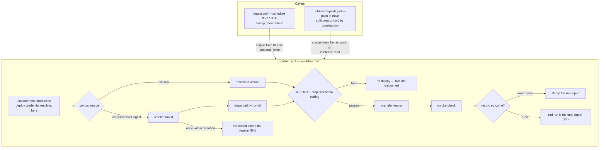

# Code-Triggered Publish Path - Plan

## Goal Capsule

- **Objective:** Let a code change reach the live site when it lands on the default branch, instead of waiting up to a day for the next scheduled ingest — by entering the existing publish job through a second door rather than building a second deploy surface.
- **Product authority:** This plan owns the publish trigger and the shape of the publish job. It does not change what gets deployed, the app, the ingest, the corpus schema, or the on-demand handler.
- **Open blockers:** None in code. One repository-settings prerequisite — `main` is unprotected, and this plan shortens the window in which that matters from a day to minutes (see Prerequisite below).
- **Origin:** Implements R7, deferred out of [the deployment plan](docs/plans/2026-08-01-003-ci-cloudflare-deployment-plan.md) during its review. Each of that plan's four recorded traps is answered by a named decision below — `workflow_run` by the trigger decision, the shared concurrency group by KTD3, the live-site fetch by KTD5, and the `SCHEMA_VERSION` deadlock by KTD7, which survives the switch to artifacts and is the one that needed new design rather than inheritance. Its R-IDs are its own; this plan numbers its requirements independently.

---

## Product Contract

### Summary

Extract the publish job into a reusable workflow and call it from two triggers: the daily sweep, and a push to the default branch. One deploy surface, two doors.

### Problem Frame

A code change is live only after the next sweep publishes it. The sweep runs once a day at 05:17 UTC and takes about two and a quarter hours, so a one-line copy fix merged at 09:00 waits twenty hours. The deployment plan deferred this deliberately — the publish path did not exist yet, and landing a second trigger against a system that was not yet live would have made the trigger foundational rather than additive ([origin, Scope Boundaries](docs/plans/2026-08-01-003-ci-cloudflare-deployment-plan.md)). It is live now.

The publish job is already the right shape for this. It takes a fresh checkout of the branch tip, runs lint and tests, refuses a corpus its code cannot read, builds, deploys, and smoke-checks the live deployment against the bytes it just published. None of that is specific to having just swept. What is specific is where the corpus comes from: the sweep hands its corpus to the publish job as an artifact, and a code push produces no corpus at all.

That single asymmetry is the work. Everything else is moving the job somewhere both triggers can reach it.

### Requirements

**Publishing**

- R1. A push to the default branch publishes the current code with the most recent swept corpus, without waiting for the next ingest.
- R2. Both publish paths run the same job — same gates, same smoke check, same deploy step — so a change to how publishing works cannot apply to only one of them.
- R3. The two paths never deploy concurrently.
- R4. A code-triggered publish that cannot obtain a corpus does not deploy, and says why.

**Trust boundary**

- R5. The deploy credential remains reachable only from the default branch, and only through a job a repository collaborator caused to run. Fork-authored code never reaches it.
- R6. Each caller holds the narrowest repository permissions its own path needs.

**Visibility**

- R7. A failed code-triggered publish is visible as a failed workflow run. It does not write to the committed run report, which describes one sweep.
- R8. A publish is verified to have taken effect on both paths, by a means that does not depend on the deployed payload having changed.

### Key Decisions

- **The trigger is a push to the default branch, not a chained workflow.** *(Inherited from the origin's KTD2, which ruled out `workflow_run` because [`ci.yml`](.github/workflows/ci.yml) runs on `pull_request` with no branch filter, so a fork-authored run would execute a privileged token-holding job — and a branch filter cannot help, since a fork can name its branch `main`.)* GitHub documents `push` as the reference point for events only collaborators can cause. Governs R1, R5.
- **The code-triggered path records nothing in the run report.** The report describes one sweep — its sources, counts, and what became of its deploy. Stamping an unrelated afternoon merge's outcome onto this morning's sweep would make the `publish` field stop describing the run the rest of the file describes. The origin plan already anticipated this under "Not covered by R8". Governs R7.
- **No corpus, too old a corpus, or a mismatched schema means no deploy.** A Worker deployed with a missing or stale corpus is a healthy-looking site with an empty or wrong ranking, which is the failure class this project has spent two review rounds closing. Refusing is also the honest coupling: the site is not worth deploying without a corpus. Staleness is bounded explicitly rather than left to artifact retention, so a run of failed sweeps cannot quietly ship a week-old ranking. Governs R4.
- **A manual "publish now" button was rejected, on the record.** `workflow_dispatch` on the reusable workflow would meet the objective at one click per merge, and would dissolve most of what this plan defends — no new automatic path to the credential, no unattended race with the sweep, an operator watching the run R7 says is the only signal. It is rejected because a publish that needs a step is a publish that gets skipped, and the fix this exists for is the routine one-line change nobody wants to ceremony over. Governs R1.

### Scope Boundaries

**Deferred for later**

- Replacing the long-lived Cloudflare API token with OIDC federation. It would remove the standing credential entirely and is the single largest improvement available to this threat model, but whether Cloudflare supports GitHub OIDC was not verified during planning. Investigate before committing to the token design long-term.
- Raising the corpus artifact's seven-day retention. R4 makes the expiry safe rather than silent, so widening the window is a comfort knob, not a correctness fix.
- Preview deployments for pull requests, and a custom domain. Both were already deferred by the origin plan and are untouched here.

**Outside this product's identity**

- Committing the corpus so a code publish could read it from the checkout. KTD11 of [the original plan](docs/plans/2026-07-28-001-feat-gamerankscout-plan.md) stands: the corpus is a deployment artifact and is never committed.
- Fetching the corpus from the live site. The origin plan rejected this on the record — it makes the deploy's input its own previous output, and it fails precisely when the site is unreachable.

---

## Planning Contract

### Key Technical Decisions

- KTD1. **The publish job moves into a reusable workflow called by both triggers.** A copy would drift: the job carries five separate guards that each exist because they were once missing, and a second copy is a second place for the sixth to be forgotten. `workflow_call` is the only mechanism that lets two triggering workflows share one job definition. Governs R2.
- KTD2. **`environment: production` is declared inside the reusable workflow, not on the calling jobs.** GitHub does not permit `environment` on a job that calls a reusable workflow — the permitted keys are `name`, `uses`, `with`, `secrets`, `strategy`, `needs`, `if`, `concurrency`, and `permissions`. Declaring it inside also means the Cloudflare secrets resolve from the environment directly, so neither caller passes them and `secrets: inherit` is never needed. Governs R5.
- KTD3. **The shared concurrency group is a literal string on each calling job.** `${{ github.workflow }}` resolves to the *caller's* name inside a reusable workflow, so an interpolated group would produce two different groups and the two paths would race. Whether a workflow-level `concurrency` block inside a called workflow is honored is undocumented; a literal group on each calling job is the behavior GitHub does document. Note what this buys and what it does not: `cancel-in-progress: false` protects the *running* job, not the waiting one — GitHub cancels an already-pending job when a newer one queues. A sweep publish waiting behind a push publish can therefore be dropped, and a cancelled calling job runs none of its `always()` steps, so that day's report keeps `not_attempted`. Accepted: the next sweep republishes, and an un-stamped report is itself a visible signal. Governs R3.
- KTD4. **The calling job is the only place permissions are granted; the reusable workflow declares none.** A `workflow_call` chain resolves the called job's token from what the caller granted, and a called job asking for more does not get narrowed — the run fails outright. So the union cannot live in the reusable workflow: the sweep's calling job grants `contents: write` because it commits the outcome, and the push caller grants `contents: read`. Both grant `actions: read` for the cross-run artifact lookup. Governs R6.
- KTD5. **The corpus comes from the newest unexpired `corpus` artifact, selected by artifact rather than by run conclusion.** A run's conclusion is the proxy this repository has already rejected once: `ingest.yml` exposes the sweep *step's* outcome precisely because a run can produce a good corpus and then fail its report push. After U1 the publish job is part of that run, so any publish failure also makes the run non-successful — and R7 requires publish failures to be red runs. Selecting on conclusion would therefore skip good corpora and walk backwards through retention. The artifact's existence is the honest predicate, because the sweep uploads it only when the sweep step succeeded. Governs R1, R4.
- KTD6. **`publish.yml` refuses to run for any event outside an allowlist.** R5's boundary otherwise rests on today's caller inventory rather than on a control. The `production` environment's branch policy keys on `github.ref`, which is `refs/heads/main` for both `workflow_run` and `pull_request_target` — the two events that carry fork-influenced content — so the policy would admit exactly what the origin's KTD2 rejected. A first-step guard on `github.event_name` is what makes the rejection enforced rather than conventional. Governs R5.
- KTD7. **A `SCHEMA_VERSION` bump is published by the sweep, not by the push path.** The fourth trap the origin recorded survives the switch from live-site to artifact: the last sweep's corpus carries the old version, so every push publish after a bump fails the pairing gate until the next sweep. Failing closed is right, but a day of red publish runs would teach the maintainer that red publish runs are normal — and R7 spends its only signal on that. The corpus-resolution step compares the resolved corpus's version to the tree's and stops with a *neutral* conclusion and a named reason, so the deadlock announces itself once instead of alarming repeatedly. Governs R4, R7.
- KTD8. **The push path gets its own deploy-identity assertion, because the smoke check's loses its power there.** `scripts/smoke.ts` proves a deploy took effect by matching the served corpus timestamp and the served bundle name against what this run produced. On the push path the corpus is redeployed unchanged, so that half can never fail; and for a push that changes no client code — the Worker, the manifest, the headers, a workflow — the Vite bundle hash is identical too, so neither half can. A `wrangler deploy` that reported success without taking effect would be recorded as verified, which is the exact failure the two arguments were added to catch. The publish job captures the version id `wrangler deploy` reports and asserts the live deployment serves it. Governs R2, R8.
- KTD9. **Actions are pinned to full commit SHAs, with local reusable-workflow calls the one stated exception.** This change makes a job holding a deploy credential reachable by merging a pull request rather than only by cron, which raises what a compromised action can reach; the 2025 `tj-actions/changed-files` compromise moved every tag from v1 through v45 onto one malicious commit, so tag pinning is not a control. A same-repository call is written `./.github/workflows/publish.yml` and accepts no ref at all — it resolves from the caller's own commit, so there is nothing to pin. Stating the exception up front keeps it from being discovered as a red test and loosened into a hole. Governs R5.

### High-Level Technical Design

Two triggers, one job:

Both calling jobs declare `concurrency: { group: publish, cancel-in-progress: false }` — the literal group, per KTD3, is what keeps the two arrows from arriving at once.

### Prerequisite: protect the default branch

`main` currently has no branch protection and no rulesets — verified against the repository during planning.

The exposure is the credential, not code quality. On an unprotected default branch in a public repository, anyone with write access — or any compromised write-access account — can push a modified workflow file straight to `main`, and it executes inside `environment: production` with the Cloudflare token in scope. Lint and tests do not defend this: they gate the application, not the workflow definition that runs them. Neither does the `production` environment's branch policy, which permits `main` — exactly where the push lands. [`ingest.yml`](.github/workflows/ingest.yml) already names this threat in a comment; the branch ruleset is the only control that answers it.

Land a ruleset on `main` requiring a pull request and a passing `check` before this plan's trigger goes in.

**The ruleset must name `github-actions[bot]` as a bypass actor.** The sweep pushes `data/run-report.json` to `main` on every run, and that commit is the heartbeat that keeps the host from disabling the schedule after 60 days of inactivity (KTD6 of [the original plan](docs/plans/2026-07-28-001-feat-gamerankscout-plan.md)). A ruleset without the bypass rejects that push, the retry loop exhausts, and the heartbeat dies quietly two months later. Switching those pushes to a PAT or App token is not an acceptable escape — U3's note explains why: those tokens *do* create workflow runs, so every sweep would fire a publish.

Verify a full sweep completes and pushes its report with the ruleset in place **before** U3's trigger is enabled.

### Assumptions

- `actions/download-artifact`'s `run-id` and `github-token` inputs behave as documented for a same-repository cross-run fetch with the default token. The pin must be a release that actually carries `run-id` — it arrived partway through v4 — and the v5-through-v8 release notes should be read before bumping.
- The REST listings are not documented as sorted, so the newest artifact is selected by comparing timestamps rather than by taking the first element.
- The push path makes cross-commit corpus/code pairing routine rather than exceptional: it deploys commit N's code against a corpus written by whatever was on `main` at 05:17. `SCHEMA_VERSION`'s bump criterion is written around cache invalidation, so an additive field shipped in one PR — ingest writes it, app reads it — may not obviously earn a bump, and the pairing gate would pass while the app reads a corpus missing the field it now expects. Worth widening that criterion in [`src/corpus/schema.ts`](src/corpus/schema.ts) to cover reader-side dependence, not only unreadability.
- The `production` environment carries a deployment-branch policy and no required reviewers. A reviewer rule would turn R1's "within minutes" into "whenever someone clicks", and would park a push publish in the shared concurrency group while the sweep's publish waits behind it.

---

## Implementation Units

### U1. Extract the publish job into a reusable workflow

**Goal:** One publish job definition, callable by two triggering workflows, with the environment and secrets resolving inside it.

**Requirements:** R2, R5 (KTD1, KTD2, KTD4, KTD6)

**Dependencies:** None.

**Files:**
- `.github/workflows/publish.yml` (create)
- `.github/workflows/ingest.yml` (modify — the publish job becomes a call)
- `test/ingest-workflow.test.ts` (modify — existing assertions follow the job to its new file)
- `src/ingest/report.test.ts` (modify — its outcome-enum cross-check reads `ingest.yml` and slices from the literal `'Record the publish outcome'`; repoint it at `publish.yml`. Its `indexOf`/`slice` degrades silently on a miss, and the `assigned.length > 0` guard is the only thing that catches it)

**Approach:**

1. Move the publish job body verbatim into a new workflow with `on: workflow_call`, declaring inputs for the two things that differ between callers: which run's corpus to use, and whether to record the outcome.
2. Keep `environment: production` on the job inside this workflow. The Cloudflare secrets then resolve from the environment and neither caller passes them.
3. Declare **no** job-level `permissions:` here. The caller's grant is the ceiling and a called job asking for more fails the run, so the grant lives on each calling job (KTD4) — not as a union in this file.
4. Add the event-allowlist guard as the job's first step (KTD6): `schedule`, `workflow_dispatch`, and `push` proceed; anything else fails before the deploy credential is used.
5. Replace the publish job in `ingest.yml` with a call, keeping its `if:` gate on the sweep step's outcome and moving `concurrency: { group: publish, cancel-in-progress: false }` plus `permissions: { contents: write, actions: read }` onto the calling job.

**Patterns to follow:** The job body already carries its reasoning in comments — every one of them documents a failure that happened. Move them with the code; do not summarize them.

**Test scenarios:**
- The reusable workflow declares `environment: production` on its job, and no caller declares `environment` (GitHub rejects it there).
- The reusable workflow declares no job-level `permissions` block; each calling job declares its own.
- The reusable workflow's first step is the event allowlist, and it precedes any step that uses the deploy credential.
- Both calling jobs declare `concurrency.group` as the literal `publish`, not an interpolation.
- The sweep's call still gates on the sweep step's outcome, not the job's.
- Neither caller passes the Cloudflare secrets, and the reusable workflow does not declare them as `workflow_call` secrets.
- The outcome-enum cross-check in `src/ingest/report.test.ts` reads the file that now holds the recording step, and still fails when the literals drift from the enum.

**Verification:** `npm test` passes with the relocated assertions, and the workflow files parse.

---

### U2. Source the corpus from the last successful sweep

**Goal:** A caller with no corpus of its own obtains the most recent swept corpus, or does not deploy.

**Requirements:** R1, R4 (KTD5, KTD7)

**Dependencies:** U1.

**Files:**
- `.github/workflows/publish.yml` (modify)
- `test/publish-workflow.test.ts` (create)

**Approach:**

1. When the caller supplies no run id, list `corpus` artifacts, keep the unexpired ones produced from the default branch, and take the newest by creation time. Do not filter on the producing run's conclusion (KTD5) — the sweep uploads the artifact only when the sweep step succeeded, so the artifact's existence already carries the predicate, and a run that swept well then failed a later step still holds a good corpus.
2. Download it with `run-id` and a token carrying `actions: read`. Extract to the runner temp directory, then copy exactly `corpus.json` to `public/corpus.json` — nothing else. The temp hop is only half the control: an artifact is a zip whose member paths its producer chooses, and moving a whole directory into `public/` would put unreviewed members into the asset set `wrangler deploy` publishes. Fail if that one file is absent or the archive carries anything else.
3. Compare the resolved corpus's `generatedAt` against now and its `schemaVersion` against the tree's. Too old, or version-mismatched, stops the publish (KTD7) — the version case with a neutral conclusion and a named reason, so a `SCHEMA_VERSION` bump announces the wait for the next sweep rather than producing a day of red runs.
4. When nothing is found, or its artifact is outside retention, fail the step with a diagnostic naming the cause and the remedy. Do not continue to the build.

**Execution note:** The retention failure is the interesting path and the one that will not occur naturally for weeks. Exercise it deliberately — a run id known to be expired, or a stubbed lookup returning nothing — before trusting the happy path.

**Patterns to follow:** `scripts/smoke.ts` for how this repo words a failure that names both the observation and what it implies.

**Test scenarios:**
- The corpus-resolution step requests `actions: read` and passes both `run-id` and `github-token`.
- The lookup does not filter on the producing run's conclusion — an ingest run that concluded `failure` with a successful sweep step is still an eligible source.
- No eligible artifact found: the workflow fails before the build step, and the message names retention as the cause.
- Artifact download fails: same, and the deploy step is not reached.
- Only `corpus.json` leaves the extract directory; an archive carrying an extra member fails the step.
- A corpus older than the stated maximum stops the publish with the same named-cause diagnostic.
- A corpus whose `schemaVersion` does not match the tree stops the publish with a neutral conclusion, not a failure.
- A run id supplied by the caller bypasses the lookup entirely.

**Verification:** The failure path is observable — a run with no reachable artifact fails at corpus resolution, not at deploy, and its log names the reason.

---

### U3. Add the code-triggered trigger

**Goal:** A push to the default branch publishes.

**Requirements:** R1, R3, R5, R6 (KTD3, KTD4)

**Dependencies:** U1, U2.

**Files:**
- `.github/workflows/publish-on-push.yml` (create)
- `test/publish-workflow.test.ts` (modify)

**Approach:**

1. Trigger on `push` with an explicit `branches: [main]` — a bare `push` also fires on tags.
2. Call the reusable workflow with no run id (so U2's lookup runs) and outcome recording off.
3. Set the literal `publish` concurrency group on the calling job, matching the sweep's.
4. Narrow permissions to `contents: read` and `actions: read`. This path commits nothing.
5. Add `paths-ignore` for documentation and the run-report path as a cost measure, with a comment recording what it is not: path filters fail open on large pushes, so this cannot be relied on to prevent a publish.

**Approach note on the loop that is not one:** commits pushed by a workflow using `GITHUB_TOKEN` do not create workflow runs, so the sweep's report commits cannot trigger this workflow. That property is load-bearing and invisible — record it in a comment at the sweep's push step, because switching that push to a PAT or App token to satisfy a future ruleset would silently start firing a publish on every sweep.

**Test scenarios:**
- The trigger declares `branches: [main]` explicitly.
- The calling job's concurrency group is the literal `publish`, identical to the sweep's.
- The calling job declares `contents: read`, not `write`.
- The call passes outcome recording as off.

**Verification:** A merge to the default branch produces a publish run that deploys the merged code and passes the smoke check; the run appears in the same concurrency group as the sweep's publish.

---

### U4. Make outcome recording belong to the sweep

**Goal:** The run report keeps describing one sweep.

**Requirements:** R7

**Dependencies:** U1.

**Files:**
- `.github/workflows/publish.yml` (modify)
- `test/publish-workflow.test.ts` (modify)

**Approach:**

1. Gate the run-report download, the `record-publish.ts` step, and the outcome commit on the recording input. Declare it `type: boolean` with `default: false` — a string input makes `'false'` truthy in a step `if:`, so the push path would run all three and then fail the commit under `contents: read`, which is a confusing way to learn the input was mistyped.
2. Keep those steps' existing `always()` conditions inside that gate — they exist because a failed publish is exactly when the outcome must still be written, and narrowing them now would re-open a closed bug.
3. When recording is off, the workflow's own conclusion is the record. Say so in a comment, and name what it costs: the committed report now covers one of two publish paths, so `publish: published` describes *this sweep's* deploy attempt and is not a claim about what is currently live. For a code push, the live answer is the deployed Worker version in Cloudflare, not anything in this repository.
4. Say the same thing where the field is defined, in [`src/ingest/report.ts`](src/ingest/report.ts) — a reader meets the field there before they meet the workflow.

**Test scenarios:**
- With recording off, the report artifact is not downloaded and `record-publish.ts` does not run.
- With recording on, all three steps run and retain their `always()` conditions.
- The recording input is declared `type: boolean`.
- The outcome literals the workflow can emit still match the closed enum in `src/ingest/report.ts` — the existing cross-check follows the steps to their new file.

**Verification:** A code-triggered run leaves `data/run-report.json` untouched; a sweep still stamps it.

---

### U5. Pin actions to commit SHAs

**Goal:** A compromised action tag cannot reach the deploy credential.

**Requirements:** R5 (KTD9)

**Dependencies:** U1, U3 — both introduce local `uses:` calls this unit's rule must exempt, and U1 rewrites the job body being pinned. Pinning first would pin a file mid-move.

**Files:**
- `.github/workflows/publish.yml`, `.github/workflows/publish-on-push.yml`, `.github/workflows/ingest.yml`, `.github/workflows/ci.yml` (modify)

**Approach:** Replace every third-party `uses: <action>@v<n>` with the full commit SHA of that version's current release, keeping the human-readable version in a trailing comment so the pin stays legible and updatable. Pin `download-artifact` to a release that carries the `run-id` input — it arrived partway through v4, and an earlier SHA would silently remove KTD5's mechanism.

**Test scenarios:**
- Every `uses:` value is either a 40-character hex SHA or a local reference beginning exactly `./.github/workflows/` — no other form. Written as that two-branch rule so the plan's own local calls pass on merit rather than forcing a loosened pattern.
- At least one third-party `uses:` is matched by the SHA branch. Without this companion assertion, a future loosening could reduce the guard to covering nothing while staying green — the shape of [the one-file fixture check](docs/solutions/security-issues/fixture-sanitisation-check-covered-one-file.md).

**Verification:** `npm test` passes and CI is green on the pinned SHAs.

---

### U6. Cover the new workflows the way the old one is covered

**Goal:** The invariants that took an incident to learn hold across both publish paths.

**Requirements:** R2, R3, R6

**Dependencies:** U1, U2, U3, U4, U5.

**Files:**
- `test/workflow-helpers.ts` (create — the `job()` slicing helper, currently file-local)
- `test/ingest-workflow.test.ts` (modify — import the shared helper)
- `test/publish-workflow.test.ts` (modify)

**Approach:** Lift the existing `job()` helper into a shared module and use it across both suites. Then assert the cross-workflow invariants that no single file's tests can see: the two callers share one literal concurrency group; only the sweep records an outcome; the reusable workflow owns the environment; every checkout still pins `ref`.

**Execution note:** These are string assertions against YAML, which is blunt. Check each one against the pre-change files — an assertion that passes before the change is not testing the change.

**Test scenarios:**
- Both calling jobs name the same literal concurrency group.
- Exactly one caller enables outcome recording.
- The reusable workflow declares the environment; no caller does.
- No workflow that calls `publish.yml` declares `workflow_run` or `pull_request_target` as a trigger. This is the invariant the environment's branch policy cannot enforce — it admits any event whose ref is the default branch, which both of those are (KTD6).
- Every checkout in a workflow that deploys or commits pins `ref` to the branch name. [`ci.yml`](.github/workflows/ci.yml) is exempt by name, not by pattern: on `pull_request` its ref is a merge ref, which is the correct thing to check out and is not a resolvable branch name.
- The `uses:` rule from U5 holds across every workflow file, and its exemption list is exact paths rather than a prefix — a loose carve-out is how a real action gets smuggled past a guard.

**Verification:** Each new assertion fails against the pre-change workflow files and passes after.

---

### U7. Prove the deploy took effect without relying on the payload changing

**Goal:** A publish is verified against the version it just created, on both paths.

**Requirements:** R2, R8 (KTD8)

**Dependencies:** U1.

**Files:**
- `scripts/smoke.ts` (modify)
- `scripts/smoke.test.ts` (modify)
- `.github/workflows/publish.yml` (modify)

**Approach:**

1. Capture the version id `wrangler deploy` reports and pass it to the smoke check alongside the corpus timestamp and bundle path.
2. Assert the live deployment serves that version. If Cloudflare exposes no readable version marker on the served response, stamp the build with the deploying commit and have the smoke check fetch and compare that instead — either way the assertion must be something only *this* deploy could satisfy.
3. Keep the existing two identity arguments. They are not redundant: on the sweep path they still discriminate, and the point is that no path is left with zero discriminating assertions.

**Execution note:** Start from the failure. Point the check at a running deployment whose version differs from the expected one and confirm it fails — the existing corpus and bundle assertions will both be green in that state, which is precisely the blind spot this closes.

**Patterns to follow:** The identity arguments already in `scripts/smoke.ts`, and the mutation-style verification the repo used when it added them.

**Test scenarios:**
- A live deployment reporting a different version fails, while the corpus and bundle assertions pass.
- A matching version passes.
- A missing or unreadable version marker fails rather than being treated as a match.
- The failure message names the served version and the expected one.

**Verification:** The new assertion fails against a deployment that did not take effect, in a case where both existing identity checks pass.

---

## Verification Contract

| Gate | Command | Applies to |
|---|---|---|
| Type check and lint | `npm run lint` | U1-U6 |
| Test suite | `npm test` | U1-U6 |
| Workflows parse | `npx --yes js-yaml .github/workflows/<file>` | U1, U3 |
| Deployed surface | `npx tsx scripts/smoke.ts $DEPLOY_ORIGIN "$generated_at" "$bundle"` | U3 |

The suite runs without network access, so every unit above is verified against workflow *files* rather than workflow *runs*. That is a real limit: the first genuine proof is a merge to the default branch producing a green publish run. Treat the first code-triggered publish as part of the work, not as something that happens after it.

**Recovery — a bad deploy.** Unchanged from the origin plan: Worker versions are immutable and `wrangler rollback` reaches the 100 most recent. A code-triggered publish that deploys something bad is rolled back the same way a scheduled one is. If the new trigger itself misbehaves, deleting `publish-on-push.yml` restores the previous single-path behavior without touching the publish job.

**Recovery — a leaked credential.** A different failure with a different answer, and one neither this plan nor the origin had. `wrangler rollback` does nothing about a token that has left the runner. Revoke it in the Cloudflare dashboard — revocation is immediate and makes the next publish fail loudly rather than quietly — then issue a replacement scoped as the origin specified (`Workers Scripts:Edit`, this account only, no zone or account-read scopes), update the `production` environment secret, and audit recent Cloudflare deployments for versions this repository did not produce. This plan makes the credential reachable on every merge rather than only on the daily cron, which is the reason to write the procedure down now and to treat the OIDC deferral as a dated one.

## Definition of Done

- `main` requires a pull request and a passing `check`, with `github-actions[bot]` bypassing both — and a full sweep has completed and pushed its report under that ruleset — before this plan's trigger is enabled.
- A merge to the default branch deploys that code within minutes, without waiting for a sweep.
- The scheduled sweep still publishes exactly as it did before, through the same job the push path uses.
- The two paths cannot deploy concurrently.
- A code-triggered publish that cannot obtain a current-enough, readable corpus does not deploy and names the cause.
- Every publish is verified against the version it created, on both paths.
- `publish.yml` refuses any event outside its allowlist.
- The committed run report is written only by the sweep, and says so where the field is defined.
- `npm run lint` and `npm test` pass, and every new workflow assertion fails against the pre-change files.
- Dead-end or experimental workflow variants from approaches that did not pan out are removed from the diff.

---

## Open Questions

**Deferred to implementation**

- Whether the corpus lookup resolves the run id inside the reusable workflow or in a small preceding job. A separate job keeps the reusable workflow's inputs simpler; a step keeps it to one job. Either satisfies R4.
- The exact `paths-ignore` set. It is a cost measure only, so it can be tuned after watching which pushes trigger publishes that change nothing.

**Recorded, not acted on**

- Review of the deployment plan argued the corpus for a code-triggered publish should come from the ingest artifact rather than the live site. This plan does that, and KTD5 records why the live site stays rejected.
- GitHub's 2026 Actions roadmap includes scoped secrets, which would bind a credential to a specific environment and workflow identity rather than letting it flow implicitly. That would strengthen KTD2's arrangement, but nothing there is shippable today.

## Sources & Research

- [Securely using `pull_request_target`](https://docs.github.com/en/actions/reference/security/securely-using-pull_request_target) — documents `push` as the trust reference point for collaborator-only events, which is what makes KTD2's trigger choice sound.
- [Events that trigger workflows](https://docs.github.com/en/actions/reference/workflows-and-actions/events-that-trigger-workflows) — `workflow_run` privilege escalation, and that its `branches` filter matches the *triggering* workflow's branch.
- [Preventing pwn requests](https://securitylab.github.com/resources/github-actions-preventing-pwn-requests/) — the fork-PR to `workflow_run` chain the origin's KTD2 rejects.
- [Reuse workflows](https://docs.github.com/en/actions/how-tos/reuse-automations/reuse-workflows) — the permitted keys on a calling job (no `environment`), environment-secret resolution, and the `github` context belonging to the caller.
- [Triggering a workflow](https://docs.github.com/en/actions/how-tos/write-workflows/choose-when-workflows-run/trigger-a-workflow) — commits pushed with `GITHUB_TOKEN` do not create workflow runs; a PAT or App token does.
- [Workflow syntax — paths/paths-ignore](https://docs.github.com/en/actions/reference/workflows-and-actions/workflow-syntax) — path filters fail open above 1,000 commits, which is why U3 treats them as a cost measure.
- [`actions/download-artifact`](https://github.com/actions/download-artifact) — `run-id` and `github-token` for cross-run retrieval, and the guidance to extract outside the workspace.
- [Usage limits and administration](https://docs.github.com/en/actions/administering-github-actions/usage-limits-billing-and-administration) — artifact retention, and that expired artifacts are deleted rather than archived.
- [Secure use reference](https://docs.github.com/en/actions/reference/security/secure-use) — SHA pinning as the only immutable action reference (KTD6).
- [`.github/workflows/ingest.yml`](.github/workflows/ingest.yml) — the publish job being extracted, its guards, and the comment already reserving the shared concurrency group for this path.
- [`test/ingest-workflow.test.ts`](test/ingest-workflow.test.ts) — the string-assertion pattern and the `job()` helper U6 lifts.
- [`docs/solutions/security-issues/fixture-sanitisation-check-covered-one-file.md`](docs/solutions/security-issues/fixture-sanitisation-check-covered-one-file.md) — a guard scoped to one file read as a repository-wide guarantee; the reason U6 asserts across all workflow files rather than the ones being edited.
- [The deployment plan](docs/plans/2026-08-01-003-ci-cloudflare-deployment-plan.md) — R7's deferral, its four traps, and KTD2/KTD3 which this plan inherits.
