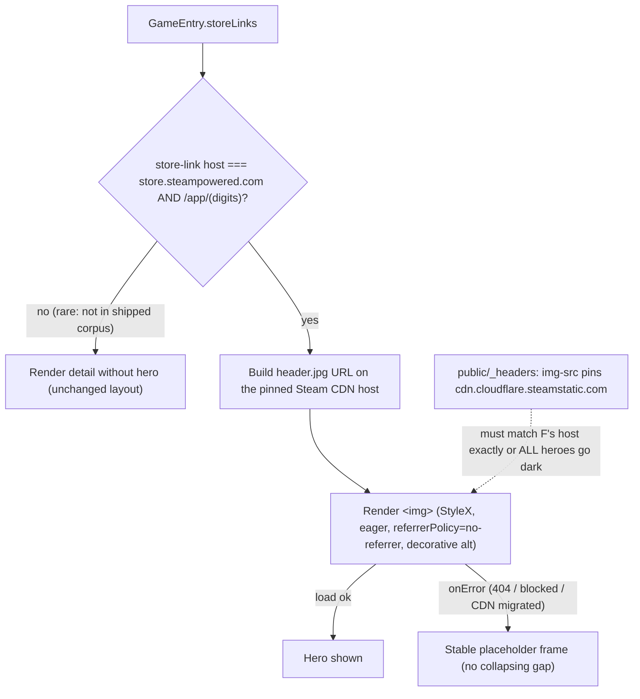
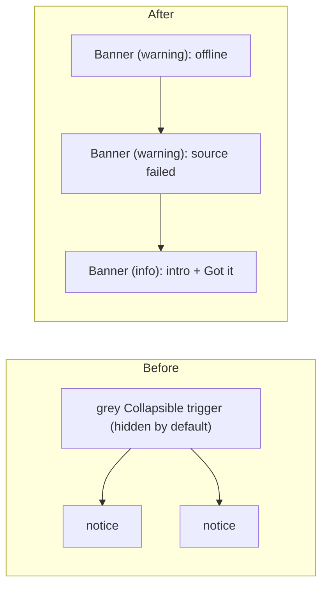

# fix: Astryx UX polish and app-wide redesign pass

## Summary

The Astryx re-theme (PR [#6](https://github.com/qgauvrit/GameRankScout/pull/6)) shipped the new Stone/orange design system but introduced a set of UX and visual oddities. This plan fixes the concrete ones the user flagged — tight top margin, a hidden grey "notice" bar, a still-teal favicon, weak external-link affordance, and a thin game-detail panel — and runs a **deep, app-wide UX redesign pass** across every screen and state to make the whole app feel intuitive. It also closes a latent bug the branch introduced: two inline `style` attributes that the deployed CSP (`style-src 'self'`, no `unsafe-inline`) will silently drop in production.

Two scope decisions were settled with the user before planning:
- **Hero image** comes from the **Steam header image, derived at render time** from the entry's Steam store-link app id — no API key, no corpus/ingest change (over a RAWG/IGDB ingest enrichment).
- **UX pass** is a **deep app-wide redesign pass**, not just the five named items (over a targeted-only fix set).

---

## Problem Frame

The frontend renders correctly and passes its suite, but several interactions read as unfinished against the new design system:

- The reading column has `paddingInline` but no top padding, so the masthead sits flush against the viewport top ([src/app/App.tsx:36-45](src/app/App.tsx)).
- Ranking notices are collapsed behind an unstyled grey `Collapsible` trigger and hidden by default — densest exactly on a cold open ([src/app/views/StatusLine.tsx](src/app/views/StatusLine.tsx)).
- The favicon and PWA icons still use the pre-theme teal (`#3a8f77` / `#7cf5c4`) instead of the theme orange ([public/icon.svg](public/icon.svg), [public/icons/](public/icons)).
- External links open correctly in a new tab (Astryx `Link` forwards `target="_blank"` and `ClickableCard` isolates nested links), but the affordance is a hand-typed `↗` glyph appended per call site — inconsistent and not a hover/focus affordance ([src/app/views/ExternalLink.tsx](src/app/views/ExternalLink.tsx), [src/app/views/Ranking.tsx:78](src/app/views/Ranking.tsx), [src/app/views/GameDetail.tsx](src/app/views/GameDetail.tsx)).
- The game-detail panel shows badges and thread links but no hero image and no visible section headings — tags are a bare badge row with only an `aria-label` ([src/app/views/GameDetail.tsx](src/app/views/GameDetail.tsx)).
- **Inline-style / CSP-hygiene gap:** [src/app/views/Ranking.tsx:68](src/app/views/Ranking.tsx) and [:109](src/app/views/Ranking.tsx) use inline `style={{…}}`, which contradicts the `_headers` comment asserting the app has "no inline `style` attributes" ([public/_headers](public/_headers)). Note: this is most likely a **hygiene/consistency** issue, **not** a functional break — React applies the `style` prop via per-property CSSOM assignment (`node.style.width = …`), which CSP `style-src` does not govern (it blocks literal `style=""` in served HTML and `setAttribute('style', …)`), and this is a client-rendered SPA with no SSR. Astryx's own `ProgressBar` ships an inline `style` for its dynamic width and is used under this same strict CSP, so the invariant comment is already inaccurate today independent of this branch. Converting to StyleX keeps the documented invariant honest and the styling consistent; **confirm in a browser under the real `_headers` policy** before asserting any production breakage.

**In scope:** frontend UX and visual corrections plus a deep app-wide redesign pass, and the CSP/img-src change needed for the Steam hero image.
**Out of scope:** ingest-pipeline or corpus-schema changes, ranking/scoring logic, and any open-database enrichment for non-Steam games (deferred).

---

## Requirements

- **R1** — The reading column has comfortable top spacing so the masthead is not flush against the viewport top, honoring the notch/status-bar safe-area inset on mobile.
- **R2** — Ranking notices are **visible by default** (not hidden behind a collapse), rendered as themed surfaces that fit the Stone/orange system rather than a grey bar, with a tone appropriate to each notice's severity. Zero notices render nothing; a large set stays manageable.
- **R3** — The favicon and all PWA icons use the theme orange (`ACCENT_ORANGE` `#f97316`, from [src/app/theme.ts](src/app/theme.ts)); no teal remains.
- **R4** — Every external link opens in a new tab (its `target`/`rel` attributes asserted by test; tab-opening confirmed in the browser walkthrough) and carries a **consistent, discoverable external-link affordance** (an icon, emphasized on hover/focus) instead of the literal `↗`, without the affordance replacing the link's visible accessible name.
- **R5** — The game-detail panel shows a **hero image** derived at render time from the entry's Steam store-link app id, and on failure (404, blocked, or CDN-host migration) falls back to a **stable placeholder in a reserved frame** — never a broken image or a collapsing layout gap. The CSP permits the exact Steam image host, and the app id is validated (trusted host + digits-only) before use.
- **R6** — The game-detail panel has **visible section headings** that orient the reader across its groups (availability/platforms, community tags, why it ranked), replacing aria-label-only grouping.
- **R7** — A **deep app-wide UX redesign pass** covers every screen and designed state (ranking, mode chips + filters control, filters sheet, evidence sheet, settings / sources / communities, and the loading / empty / sparse / offline / first-run / momentum-unavailable / filters-exhausted states) for hierarchy, consistency, spacing, touch-target size, keyboard focus visibility, and accessible naming — with findings triaged and the accepted subset applied.
- **R8** *(constraint)* — All new and changed styling is **CSP-clean**: no inline `style` attributes; styling comes from StyleX (`stylex.create`) or design-system layout props. The two existing inline-style violations in `Ranking.tsx` are converted.

---

## Key Technical Decisions

### KTD1 — Hero image: Steam header, derived at render time
Derive the Steam app id from the entry's `store: 'steam'` store-link URL and build the header image URL on the exact host **`https://cdn.cloudflare.steamstatic.com/steam/apps/<id>/header.jpg`** (verified 200 for a live app id at planning time). Render a native ``; no API key, no corpus/ingest change, no attribution obligation (Valve CDN asset). *(session-settled: user-directed — chosen over a RAWG/IGDB ingest enrichment: proportionate to a frontend branch.)* **Governs R5.**

**Corpus reality (verified):** the shipped corpus is **100% Steam** — all 1093 games carry a `store: 'steam'` link and Steam is the only store present ([public/corpus.json](public/corpus.json)). So the "no Steam link → no hero" path is effectively unreachable today, and the whole hero surface rides on this single CDN URL resolving. The dominant failure mode is therefore a **blocked or 404 image**, or a **Steam CDN host migration that darkens every hero at once** — not a missing link. Note the sibling host `shared.cloudflare.steamstatic.com` already 301-redirects to a host the pinned allowlist would block, so host choice is load-bearing (KTD2). Design the failure path accordingly (U6): a stable placeholder rather than a collapsing gap, and treat a silent whole-feature-dark event as a known post-deploy risk the build-time check cannot catch.

### KTD2 — Permit the Steam image host via CSP `img-src` allowlist
Add the **exact** host to `img-src` in [public/_headers](public/_headers) — the literal directive becomes `img-src 'self' data: https://cdn.cloudflare.steamstatic.com` (explicit `https` scheme, no bare-host token, **no `*.steamstatic.com` wildcard**) — rather than proxying images through the Worker. The allowlisted host string must match the code-built URL host in KTD1 exactly; a one-character mismatch blocks 100% of heroes silently (dev has no CSP header). Images cannot execute script, so allowlisting one image host keeps the strict `script-src`/`style-src` posture intact while avoiding new Worker code. **Privacy note:** hot-linking a third-party image makes every viewer's browser contact Valve/Cloudflare on each Steam-linked detail view, disclosing the viewer's IP and (under `Referrer-Policy: strict-origin-when-cross-origin`) the deploy origin — a tracking-pixel-shaped side effect the first-party CSP otherwise avoids; the hero `` sets `referrerPolicy="no-referrer"` (U6) to send no origin, and this disclosure is accepted for a frontend-only branch. *Alternative considered:* a same-origin Worker image proxy (keeps everything first-party and hides the referrer entirely, but adds a route, caching concerns, and latency) — deferred unless a first-party-only requirement emerges. **Governs R5.**

### KTD3 — Notices as visible `Banner`s, tone-mapped
Replace the `Collapsible` in `StatusLine` with a vertical stack of Astryx `Banner`s, one per active notice, each carrying a `status` (tone) and a title/description. `StatusItem` gains an explicit `tone` and `title`. Tone map: `offline` → warning; `failed` → warning; `intro` → info (keeps its "Got it" action); `momentum` → info; `relaxed` → info. Notices are visible by default; if more than three are active, **sort by severity first (warnings before info)**, then show the first three and collapse the remainder behind a single "more" affordance — so any collapsed remainder only ever holds lower-severity info notices and a warning is never the thing that gets hidden. Note: Astryx `Banner` only offers per-banner collapsible children, so the cross-banner "show N more" is custom logic around the stack, not a component feature. **Governs R2.**

### KTD4 — Single external-link affordance in `ExternalLink`
Move the affordance into `ExternalLink` itself: render a trailing external-link `Icon` after the children, emphasized on hover/focus via StyleX, and remove every hand-typed `↗` at call sites. Use the Icon registry's external-link glyph if one exists; otherwise pass a small inline SVG component to `Icon` (component mode). The icon is `aria-hidden`; the "opens in a new tab" semantics are conveyed by an **appended visually-hidden text node** (which *supplements* the accessible name), **not** an `aria-label` on the anchor (which would *override* the visible link text, replacing "Steam" or a thread title with "opens in a new tab"). **Governs R4.**

### KTD5 — Deep UX pass = audit unit → applied-changes unit
Deliver the deep pass as a discovery unit (U9) that produces a prioritized findings list across all surfaces, then an application unit (U10) that lands the accepted subset. Low-value findings route to Deferred rather than expanding this branch indefinitely. *(session-settled: user-directed — deep app-wide redesign pass chosen over a targeted-only fix set.)* **Governs R7.**

### KTD6 — CSP-clean styling via StyleX only
All layout/spacing/size styling uses `stylex.create` or design-system props; app-authored inline `style` attributes are removed from `src/app`. This is **hygiene/consistency** work that keeps the documented `_headers` "no inline style" invariant honest — not a fix for a functional break (see Problem Frame: React inline styles apply via CSSOM, which CSP `style-src` does not govern). The two `Ranking.tsx` inline styles are converted as foundational work (U8) so later units inherit the pattern. Caveat: design-system components (e.g. Astryx `ProgressBar`) legitimately emit their own inline `style` for dynamic values; the invariant is about *app-authored* styling, and tests must scope accordingly (U8). **Governs R8.**

---

## High-Level Technical Design

Hero-image resolution and its CSP dependency (KTD1, KTD2):

Corpus is 100% Steam (KTD1), so branch **B-no** is unreachable today and the real fork is load success vs failure at **G**:

Notices, before and after (KTD3):

---

## Output note

No new directory structure is created. New helper/asset files land beside their consumers: a Steam-image helper under `src/app/views/`, recolored icons under `public/`.

---

## Implementation Units

Suggested landing order by dependency: **U8 → U1 → U2 → U3 → U4 → U5 → U6 → U7 → U9 → U10**. U8 (StyleX pattern) is foundational; U5 (CSP) precedes U6 (hero image); U9 (audit) precedes U10 (applied changes).

### U8. CSP-clean styling foundation (convert Ranking inline styles to StyleX)
- **Goal:** Remove the two inline `style` attributes so nothing the branch renders is dropped under the production CSP, and establish the StyleX pattern later units follow.
- **Requirements:** R8.
- **Dependencies:** none.
- **Files:** `src/app/views/Ranking.tsx`, `src/app/styling.test.tsx`.
- **Approach:**
  1. Add a `stylex.create` block in `Ranking.tsx` with a `strengthMeter` rule (`width: 72px`, `flexShrink: 0`) and a `list` rule (`listStyle: none`, `margin: 0`, `padding: 0`, `display: flex`, `flexDirection: column`, `gap: 8px`).
  2. Replace the inline `style={{…}}` on the meter wrapper `
` ([Ranking.tsx:68](src/app/views/Ranking.tsx)) and the `<ol>` ([Ranking.tsx:109](src/app/views/Ranking.tsx)) with `{...stylex.props(styles.…)}`.
  3. Confirm no app-authored inline `style` remains in `src/app` (grep gate — see Verification).
- **Patterns to follow:** the existing `styles.app` `stylex.create` block in [src/app/App.tsx:36](src/app/App.tsx).
- **Test scenarios:**
  - `styling.test.tsx`: assert the **converted elements specifically** carry no `style` attribute — query the `<ol>` and the strength-meter wrapper `
` and assert neither has an inline `style`. **Do not** assert `querySelectorAll('[style]').length === 0` on the whole subtree: the rendered Astryx `ProgressBar` emits its own inline `style` for the dynamic fill width ([node_modules/@astryxdesign/core/dist/ProgressBar/ProgressBar.js](node_modules/@astryxdesign/core)), so a subtree-wide assertion is permanently unsatisfiable.
  - The evidence-strength meter still renders at its fixed width (class applied), and the list still renders one `<li>` per ranked entry in order.
- **Verification:** `npm run lint` and `npm test` green; a repo grep for `style={{` under `src/app` (excluding tests) returns nothing (this is a source grep of app code, distinct from the DOM assertion above, which must tolerate the design system's own inline styles).

### U1. Reading-column top spacing
- **Goal:** Give the masthead breathing room from the viewport top, safe-area aware.
- **Requirements:** R1.
- **Dependencies:** U8 (styling stays in StyleX).
- **Files:** `src/app/App.tsx`, `src/app/styling.test.tsx`.
- **Approach:** In the `styles.app` block, add block-start padding using the design system's spacing scale, composed with the safe-area inset (e.g. `paddingTop: 'max(<scale-token>, env(safe-area-inset-top))'`) so notched devices clear the status bar while non-notched devices get the base gap. Keep `paddingBottom: env(safe-area-inset-bottom)`.
- **Patterns to follow:** existing `styles.app` inset handling in [src/app/App.tsx:36](src/app/App.tsx).
- **Test scenarios:**
  - Test expectation: none for the exact pixel value — spacing is visual. Add/keep a `styling.test.tsx` assertion only that the app container still mounts through the design system.
- **Verification:** browser check at desktop and mobile widths — the masthead has a clear top gap; nothing overlaps the status bar in the mobile preset.

### U2. Notices as visible themed Banners
- **Goal:** Make notices visible by default and native to the theme, replacing the grey collapsible.
- **Requirements:** R2.
- **Dependencies:** none (coordinates with App status construction).
- **Files:** `src/app/views/StatusLine.tsx`, `src/app/views/StatusLine.test.tsx`, `src/app/App.tsx`.
- **Approach:**
  1. Extend `StatusItem` with `tone: 'info' | 'warning'` and a short `title` string; keep `content` (description) and `live`.
  2. Rewrite `StatusLine` to render a vertical `Stack` of `Banner`s — one per active notice — mapping `tone` to the Banner `status` and passing `title`/description. Preserve the `role="status"` behavior for `live` notices. Render nothing when empty.
  3. If more than three notices are active, **sort by severity (warnings before info)**, then render the first three and collapse the rest behind one "Show N more" control — so a collapsed remainder never contains a warning. This is custom logic around the Banner stack (Astryx `Banner`'s own collapsible is per-banner, not cross-banner).
  4. The new "Show N more" control and any newly interactive element in this unit expose a visible `:focus-visible` ring and meet the ≥44px touch-target minimum — don't defer their a11y to the U9 audit that runs after this unit.
  5. In `App.tsx`, add `tone`/`title` to each of the five `statuses.push(...)` sites (offline → warning, failed → warning, intro → info, momentum → info, relaxed → info), moving the bold lead-in into `title`.
- **Patterns to follow:** Astryx `Banner` (`status`, title/description, optional actions); existing notice copy in [src/app/App.tsx:271-339](src/app/App.tsx).
- **Test scenarios:**
  - Renders one Banner per active status, in order; zero statuses render nothing.
  - A `warning` status maps to the warning Banner tone; an `info` status maps to info.
  - The intro notice still exposes its "Got it" action and firing it is preserved.
  - `live` notices still expose `role="status"`.
  - With >3 active notices including at least one warning, all warnings stay visible and only info notices are collapsed until "show more" is activated.
- **Verification:** browser check — notices are visible on load, themed (no grey bar), and the ranking still sits high on the first screen.

### U3. Theme-orange favicon and PWA icons
- **Goal:** Replace teal iconography with the theme orange.
- **Requirements:** R3.
- **Dependencies:** none.
- **Files:** `public/icon.svg`, `public/icons/icon-192.png`, `public/icons/icon-512.png`, `public/icons/icon-maskable-512.png`, `src/app/styling.test.tsx` (or a small dedicated asset test).
- **Approach:**
  1. Recolor `icon.svg`: keep the `#11131a` field; change the three bars to the orange family — the tallest bar `ACCENT_ORANGE` `#f97316`, the shorter bars a darker/less-saturated orange for depth (mirror the current two-tone teal relationship).
  2. Regenerate the three PNGs from the updated SVG at 192/512 (and the maskable 512 with its safe-zone padding). No CLI raster tool (`rsvg-convert`/ImageMagick) is present and `sharp` is only transitive, so produce them with a short ad-hoc Node/`sharp` script (or whatever is actually installed at implementation time); do not hand-edit PNGs.
  3. Leave `manifest.webmanifest` and `index.html` `theme-color` background at `#11131a` (dark chrome is intentional); only the mark changes.
- **Patterns to follow:** existing [public/icon.svg](public/icon.svg) structure; `ACCENT_ORANGE` in [src/app/theme.ts](src/app/theme.ts).
- **Execution note:** icon regeneration is asset tooling; prefer verifying the built output visually over unit coverage.
- **Test scenarios:**
  - Assert `public/icon.svg` contains `#f97316` and contains neither `#3a8f77` nor `#7cf5c4`.
  - Test expectation: none for the binary PNGs — verify visually in the browser tab and PWA install.
- **Verification:** `npm run build` re-precaches the icons; browser tab shows the orange mark; no teal in the rendered favicon.

### U4. External-link affordance in ExternalLink
- **Goal:** One consistent, discoverable external-link indicator; remove per-call-site `↗`.
- **Requirements:** R4.
- **Dependencies:** U8.
- **Files:** `src/app/views/ExternalLink.tsx`, `src/app/views/Ranking.tsx`, `src/app/views/GameDetail.tsx`, `src/app/views/ExternalLink.test.tsx` (new).
- **Approach:**
  1. In `ExternalLink`, render children followed by a trailing external-link `Icon`. Prefer the Icon registry's external-link/arrow-up-right name; if none exists, pass a small inline SVG component (Icon component mode). Give the icon an emphasized state on hover **and `:focus-visible`** via a `stylex.create` rule; mark it `aria-hidden`.
  2. Convey "opens in a new tab" with an **appended visually-hidden text node** (e.g. a `` with visually-hidden StyleX), which *supplements* the anchor's accessible name. **Do not** use an `aria-label` on the anchor — it would *override* the visible link text ("Steam", the thread title) with just "opens in a new tab".
  3. Remove the literal `↗` from the "Steam ↗" store link in [Ranking.tsx:78](src/app/views/Ranking.tsx) and the "Also on … ↗" links in [GameDetail.tsx](src/app/views/GameDetail.tsx); they now get the icon for free.
- **Patterns to follow:** existing `ExternalLink` wrapper over Astryx `Link`; `computeTargetAndRel` already merges `noopener/noreferrer`.
- **Test scenarios:**
  - Rendered anchor has `target="_blank"` and `rel` containing `noopener` and `noreferrer` (asserts the new-tab *attributes*; actual tab-opening is confirmed in the browser walkthrough, since jsdom performs no navigation).
  - The external-link icon is present and `aria-hidden`.
  - The link's **visible text survives in its accessible name** (e.g. accessible name for the store link still contains "Steam"), with the "opens in a new tab" hint appended — proving the suffix supplements rather than replaces.
  - No call site renders a literal `↗` (grep gate + render assertion on Ranking/GameDetail).
- **Verification:** browser — hovering/focusing a store/thread link shows the affordance emphasize; clicking opens a new tab and leaves the app tab in place.

### U5. CSP allowance for the Steam image host
- **Goal:** Let the hero image load under the production policy.
- **Requirements:** R5 (dependency).
- **Dependencies:** none. **Must land before U6, and must use the exact host from KTD1/KTD2.**
- **Files:** `public/_headers`.
- **Approach:** Change the `img-src` directive from `img-src 'self' data:` to the literal `img-src 'self' data: https://cdn.cloudflare.steamstatic.com` — explicit `https` scheme, the single pinned host, **no bare-host token and no `*.steamstatic.com` wildcard**. The host string must equal the host in the code-built URL (U6/KTD1) character-for-character; a mismatch silently darkens 100% of heroes under the production CSP (dev has no CSP header). Update the CSP explanatory comment to record why the host is allowed (a hot-linked store header image, not script). Leave every other directive unchanged.
- **Patterns to follow:** the existing directive block and comment discipline in [public/_headers](public/_headers).
- **Test scenarios:**
  - Test expectation: none for the static header itself, but add an equality guard: a test (or the U6 helper test) asserts the pinned host constant used to build the image URL equals the host allowed in `_headers`, so the two cannot drift.
- **Verification:** with the built site served under `_headers`, a Steam header image request is **not** blocked (no CSP violation in the console); all other hosts remain blocked.

### U6. Steam hero image in the game-detail panel
- **Goal:** Show a hero image for Steam-linked games; fail to a stable placeholder, never a broken frame or collapsing gap.
- **Requirements:** R5.
- **Dependencies:** U5 (CSP), U8 (StyleX).
- **Files:** `src/app/views/steamImage.ts` (new), `src/app/views/steamImage.test.ts` (new), `src/app/views/GameDetail.tsx`, `src/app/views/GameDetail.test.tsx`.
- **Approach:**
  1. New helper `steamHeaderImage(storeLinks): string | null` — find the `store === 'steam'` link, and **validate the untrusted URL** before use (store URLs are Reddit/Lemmy-derived — the documented trust boundary — and `storeLinkSchema` only checks the `store` enum + an http(s) URL, so a `store:'steam'` link can carry any host/path): (a) require the URL host to be `store.steampowered.com`; (b) extract the app id with an anchored **digits-only** match (`/\/app\/(\d+)(?:\/|$)/`), rejecting non-numeric or path-traversal ids. Build the CDN `header.jpg` URL from a single **pinned host constant** (shared with U5's equality guard). Return `null` when there is no Steam link, the host is wrong, or the id doesn't validate.
  2. In `GameDetail`, render a hero at the top of the panel when the helper returns a URL: an `` in a StyleX-styled frame (full-width, fixed `aspect-ratio`, `objectFit: cover`, rounded to match cards) that **reserves its box** so there's no layout shift; **eager load** (`fetchpriority="high"`, no `loading="lazy"` — it's the panel's primary above-the-fold image), `referrerPolicy="no-referrer"` (KTD2 privacy note), and a **decorative `alt=""`** (the enclosing `<section aria-label={game.name}>` and the sheet title already announce the name; `alt={game.name}` would duplicate it). On `onError`, swap to a **stable placeholder fill** in the same reserved frame (not a collapse), so a 404 or a CDN-host migration degrades to a consistent look rather than a hero-less jump.
  3. When the helper returns `null` (unreachable in today's all-Steam corpus, but kept honest), render the panel without the hero frame and no gap.
- **Patterns to follow:** graceful-degradation style already in `GameDetail` ("each block is either rendered with real content or stated as unresolved"); `stylex.create` from U8/App.
- **Test scenarios:**
  - `steamImage.test.ts`: builds the expected CDN URL from a canonical `store.steampowered.com/app/<digits>/…` link; returns `null` for a non-Steam-only link set; returns `null` for a `store:'steam'` link whose host is **not** `store.steampowered.com`; returns `null` for a non-numeric or path-traversal id (`/app/..%2f..%2f/`); returns `null` when there is no `/app/<id>/`.
  - `GameDetail.test.tsx`: with a valid Steam link, a hero `` renders with `referrerPolicy="no-referrer"` and an empty (decorative) `alt`; `onError` swaps to the placeholder within the reserved frame (no broken ``, no layout jump); with no Steam link, no hero frame renders and the rest of the panel is unchanged.
- **Verification:** browser — open a Steam entry: hero renders, no CSP violation; force a 404 (or point at a blocked host): the placeholder shows in the reserved frame, layout intact.
- **Execution note:** the dominant real-world failure is a blocked/404 image or a Steam CDN host migration (all-Steam corpus, single CDN URL — KTD1), so prove the `onError` placeholder path, not just the happy path.

### U7. Game-detail section headings
- **Goal:** Orient the reader with visible headings across the panel's groups.
- **Requirements:** R6.
- **Dependencies:** U6 (hero sits above the first heading).
- **Files:** `src/app/views/GameDetail.tsx`, `src/app/views/GameDetail.test.tsx`.
- **Approach:** Add visible `Heading`s above the grouped content — an "Availability" (or "Where to play") heading over the platform/owner/deck badges and the "Also on" links, and a "Community tags" heading over the tag badges. Keep the existing "Why it ranked" heading. Ensure heading levels are consistent and ordered (hero → availability → tags → why it ranked), and pin the level **relative to the evidence-sheet title** so nesting doesn't skip a level — the existing group heading is `Heading level={3}`, so confirm the sheet renders the game-name title at level 2 (or set these section headings one level below whatever the sheet title actually is). Replace the tag group's `aria-label`-only labeling with the visible heading (keep an accessible association).
- **Patterns to follow:** the existing `Heading level={3}` "Why it ranked" in [GameDetail.tsx](src/app/views/GameDetail.tsx).
- **Test scenarios:**
  - The panel renders visible "Availability" and "Community tags" headings when those groups have content.
  - A group with no content renders neither its heading nor an empty block (e.g., no tags → no "Community tags" heading).
  - Heading order/levels are consistent (no skipped levels).
- **Verification:** browser — the detail sheet reads as clearly labeled sections rather than stacked badge rows.

### U9. App-wide UX audit (discovery)
- **Goal:** Produce a prioritized findings list across every screen and state so U10 applies a grounded, coherent set of changes rather than ad-hoc tweaks.
- **Requirements:** R7.
- **Dependencies:** U1–U7 (audit the corrected surfaces, not the ones being replaced).
- **Files:** none (analysis; findings recorded in the PR description / a scratch note, not the plan body).
- **Approach:** Heuristic evaluation of each surface and state, checking hierarchy, spacing rhythm, consistency of component usage, touch-target size (≥44px, esp. the native `<select>`s and icon buttons), keyboard focus visibility (`:focus-visible` rings), and accessible naming. Surfaces to cover:
  1. Masthead — title, "updated Nd ago" freshness affordance, `☰` settings `IconButton`.
  2. Mode chips + the `Filters (N)` control ([FilterBar.tsx](src/app/filters/FilterBar.tsx)) — active-mode contrast, wrap behavior.
  3. Filters sheet ([FiltersSheet.tsx](src/app/filters/FiltersSheet.tsx)) — control spacing, reset affordance, dismiss.
  4. Evidence sheet ([EvidenceSheet.tsx](src/app/views/EvidenceSheet.tsx)) — `✕` close target, scroll behavior.
  5. Settings / Sources / Communities ([settings/](src/app/settings)) — back/close affordance, grouping, reversibility cues.
  6. The **ad-hoc community pull surface** in [Communities.tsx](src/app/settings/Communities.tsx) — its `loading` state and its `failed` state's four distinct reasons (`not_found`, `invalid`, `rate_limited`, `unreachable`).
  7. Every designed state — loading, empty ("No games ranked yet"), sparse, offline, first-run intro, momentum-unavailable, filters-exhausted, **and the hard corpus load-failure state** ("Could not load the rankings" + "Try again" in [App.tsx](src/app/App.tsx), which is distinct from the offline notice) — for consistent tone and calm hierarchy.
- **Severity rubric (so the accept/defer line is deterministic):** **P1** = blocks a task or fails WCAG AA (sub-44px targets, missing `:focus-visible`, unnamed controls, contrast failures); **P2** = friction or cross-surface inconsistency; **P3** = polish. **Ratifying owner:** the plan author/reviewer agrees the list before U10 begins (in autonomous execution, the P1/P2/P3 assignment + this rubric *is* the acceptance gate, and any P2 that would materially widen the branch — e.g. a new shared component — routes to Deferred).
- **Test scenarios:** Test expectation: none — discovery unit. Output is the prioritized findings list consumed by U10.
- **Verification:** a written, prioritized findings list (P1/P2/P3), covering all seven surface groups above, exists and is agreed before U10 starts. Record it in the PR description (the concrete, unambiguous source of truth for U10's accepted subset).

### U10. Apply the accepted app-wide redesign changes
- **Goal:** Land the accepted subset of U9 findings as coherent, CSP-clean changes.
- **Requirements:** R7, R8.
- **Dependencies:** U9.
- **Files:** determined by U9 findings — expected span: `src/app/App.tsx`, `src/app/filters/*.tsx`, `src/app/views/*.tsx`, `src/app/settings/*.tsx`, and their tests.
- **Approach:** Consume **only the agreed subset** from U9's ratified list (do not re-derive scope here). **P1 is required; P2 is apply-as-capacity** with any un-applied P2 routing to Deferred alongside P3 — so U10's footprint is bounded by the agreed list, not by however many findings the audit produced. Likely candidates, to be confirmed by the audit: consistent spacing scale across surfaces; visible `:focus-visible` rings on all interactive elements; ≥44px touch targets on the filter `<select>`s and icon buttons; a clearer settings close/back affordance; consistent `Card`/surface usage between ranking rows and detail; consistent notice/empty-state tone. Every change uses StyleX or design-system props (R8).
- **Patterns to follow:** the design system's spacing/typography tokens; the notice tone system from U2.
- **Test scenarios:** per accepted finding — assert the specific behavior it fixes (e.g., an icon button exposes an accessible `label`; an empty state renders its heading and description; a control is reachable and operable by keyboard). Regression: existing state/route tests stay green.
- **Verification:** `npm test` + `npm run lint` green; browser walkthrough of each surface and state at desktop and mobile widths; no inline `style` introduced.

---

## Scope Boundaries

**In scope:** the eight requirements above — frontend UX/visual corrections, the deep app-wide pass, the Steam hero image, and the `img-src` CSP change it needs.

### Deferred to Follow-Up Work
- **Open-database image enrichment for non-Steam games** — enriching the corpus at ingest with a hero image from RAWG/IGDB (with API key, schema field, and attribution) so non-Steam entries also get a hero. Deferred per KTD1; render-time Steam covers the common case now.
- **Same-origin Worker image proxy** — only if a first-party-only/referrer-hiding requirement emerges (KTD2 alternative).
- **P3 audit findings** from U9 that are not worth this branch's footprint.

### Out of scope
- Ingest pipeline, corpus schema, and ranking/scoring logic.
- The design-system adoption itself (already shipped in PR #6).

---

## Risks & Dependencies

- **Whole-feature-dark hero failure (highest-impact).** The corpus is 100% Steam and every hero rides on one hardcoded CDN URL (KTD1), so a Steam CDN host migration or a hot-link block darkens *every* hero at once — visible in production only as console CSP violations, and the build-time check (one request) cannot catch a post-deploy migration. Mitigation: pinned-host equality guard (U5/U6), a stable `onError` placeholder rather than a collapse (U6), and awareness that this is a monitored post-deploy risk, not a build-time one. Consider a CSP `report-uri`/`report-to` or a periodic host check as follow-up if heroes matter operationally.
- **CSP widening (img-src).** Allowlisting the Steam CDN host widens `img-src`. Mitigation: pin the exact `https://cdn.cloudflare.steamstatic.com` host, no wildcard; images cannot execute script, so the strict `script-src`/`style-src` posture is unaffected. Verify no other host is permitted.
- **Untrusted app-id injection.** The app id is parsed from a Reddit/Lemmy-derived store URL (`storeLinkSchema` validates only the enum + an http(s) URL). Mitigation: require host `store.steampowered.com` and an anchored digits-only id, else return `null` (U6).
- **Third-party image privacy.** Hot-linking discloses the viewer's IP/origin to Valve/Cloudflare. Mitigation: `referrerPolicy="no-referrer"` on the hero; accepted for a frontend-only branch (KTD2). Worker proxy deferred.
- **Icon regeneration tooling.** Producing the PNGs needs a raster tool. No `rsvg-convert`/ImageMagick CLI is present, and `sharp` is only a transitive dependency (a clean reinstall could drop it). Mitigation: U3 uses whatever tool is actually available (likely an ad-hoc Node/`sharp` script); do not hand-edit PNGs.
- **Inline-style is hygiene, not a functional break.** Contrary to a first reading, PR #6's two inline `style`s most likely render fine in production — React applies them via CSSOM, which CSP `style-src` does not govern (Problem Frame). U8 is worth doing to keep the documented `_headers` invariant honest and styling consistent, but **confirm the actual behavior in a browser under the real `_headers` policy before claiming any breakage**; do not assume the ProgressBar width drops.
- **Deep-pass scope creep (R7).** Mitigation: U9 severity rubric + ratified list; U10 applies P1 (required) and P2 (as-capacity, overflow → Deferred), P3 deferred.

---

## Verification / Definition of Done

- `npm test` and `npm run lint` (tsc + eslint) green.
- `npm run build` green and re-precaches the recolored icons.
- Repo **source** grep: no app-authored `style={{` under `src/app` outside tests (R8) — distinct from the DOM-level test, which tolerates the design system's own inline styles (U8).
- Built site served under `public/_headers`: the Steam hero image loads with **no** CSP violation in the console; all non-allowlisted hosts still blocked (R5). Also confirm here whether the pre-U8 inline styles actually raised any violation (Risks: they most likely did not).
- The pinned image host in code equals the `img-src` host in `_headers` (equality guard, U5/U6) — no drift.
- Browser walkthrough (desktop + mobile presets) confirms: comfortable top spacing (R1); notices visible and themed with warnings never collapsed, ranking still high on first screen (R2); orange favicon in the tab (R3); external links show the affordance on hover/focus and their visible label survives in the accessible name, and clicking opens a new tab (R4 — tab-opening is confirmed here, not by unit test); Steam-linked detail shows a hero and a forced 404 falls back to the placeholder in its reserved frame (R5); detail sections are clearly headed with no level skip (R6); each screen/state — including the hard load-failure and ad-hoc community states — passes the U9 audit's accepted bar (R7).
- Every existing designed-state and route test remains green (no regression to preserved copy/states).

---

## Sources & Research

- Astryx components verified in `node_modules/@astryxdesign/core/dist`: `Banner` (`status` tone + title/description/actions/collapsible children), `Icon` (registry-name or SVG-component modes), `ClickableCard` (nested interactive elements isolated from card navigation), `Link` + `computeTargetAndRel` (merges `noopener/noreferrer` for `target="_blank"`).
- CSP posture and the "no inline style attributes" invariant: [public/_headers](public/_headers).
- Corpus shape (`storeLinks: { store, url }`, no image field, no app-id field): [src/corpus/schema.ts](src/corpus/schema.ts).
- Notice construction and tones: [src/app/App.tsx:271-339](src/app/App.tsx).
- Prior design-system plan (context): [docs/plans/2026-08-01-002-feat-astryx-design-system-plan.md](docs/plans/2026-08-01-002-feat-astryx-design-system-plan.md).
- **Doc-review corrections (this plan):** the shipped corpus is 100% Steam (1093/1093), inverting the hero degradation assumption (KTD1); React inline styles apply via CSSOM and are not governed by CSP `style-src`, so the inline-style issue is hygiene not a functional break (Problem Frame, KTD6); Astryx `ProgressBar` emits its own inline `style`, making a subtree-wide "no inline style" DOM assertion unsatisfiable (U8); store URLs are an untrusted (Reddit/Lemmy-derived) trust boundary, so the app id must be host- and digits-validated (U6, security lens).
